## 介绍

### 简介

ElasticSearch 是一个基于 Lucene 的搜索服务器。它提供了一个分布式多用户能力的全文搜索引擎，基于 RESTful web 接口。Elasticsearch 是用 Java 开发的，并作为 Apache 许可条款下的开放源码发布，是当前流行的企业级搜索引擎。

### 使用场景

1. 为用户提供按关键字查询的全文搜索功能。 
2. 实现企业海量数据的处理分析的解决方案。大数据领域的重要一份子，如著名的ELK 框架(ElasticSearch,Logstash,Kibana)。 
3. 作为 OLAP 数据库，对数据进行统计分析。

### 与其他数据存储进行比较

|               | redis         | mysql              | es                                                           | hbase                                                        | Hadoop/hive     |
| ------------- | ------------- | ------------------ | ------------------------------------------------------------ | ------------------------------------------------------------ | --------------- |
| 容量/容量扩展 | 低            | 中                 | 较大                                                         | 海量                                                         | 海量            |
| 查询时效性    | 极高          | 较高(需要索引优化) | 较高                                                         | 较高(rowkey方式)；较低(scan方式)                             | 低              |
| 查询灵活性    | 最差，k-v模式 | 非常好，支持sql    | 较好，关联查询较弱，但是可以全文检索，DSL 语言可以处理过滤、匹配、排序、聚合等各种操作 | 较差，主要靠 rowkey,scan 的话性能不行，或者安装 phoenix 插件来实现 sql 及二级索引 | 非常好，支持sql |
| 写入速度      | 极快          | 中等(同步写入)     | 较快(异写入)                                                 | 较快(异步写入)                                               | 慢              |
| 一致性、事务  | 弱            | 强                 | 弱                                                           | 弱                                                           | 弱              |


### 特点

#### 天然的分布式数据库

ES 把数据分成多个 shard（分片），下图中的 P0-P2，多个 shard 可以组成一份完整的数据，这些 shard 可以分布在集群中的各个机器节点中。随着数据的不断增加，集群可以增加多个分片，把多个分片放到多个机子上，已达到负载均衡，横向扩展。

<center>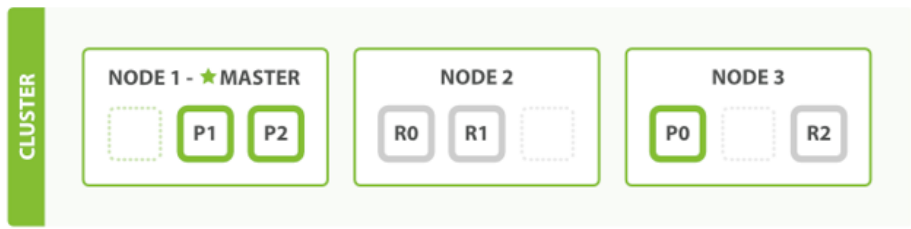</center>

Shard 共有两种类型：

- Primary Shard：将数据分布在整个集群内，解决数据水平扩展的问题
- Replica Shard：解决数据可用性的问题，是 Primary Shard 的副本
  - 副本分片数：可以为 Primary Shard 设置副本的数据，可以动态调整
  - 副本可以增加一定的吞吐量

数据如何分布在 shard，通过在创建索引时，**指定 shard 数量，创建后不允许修改**。

#### 天然索引之倒排索引

**ES 所有数据都是默认进行索引的**，这点和 mysql 正好相反，mysql 是默认不加索引，要加索引必须特别说明，ES 只有不加索引才需要说明。而 ES 使用的是倒排索引和 Mysql 的 B+Tree 索引不同。 

**传统关系性数据库索引**保存数据的方式是 记录→单词：

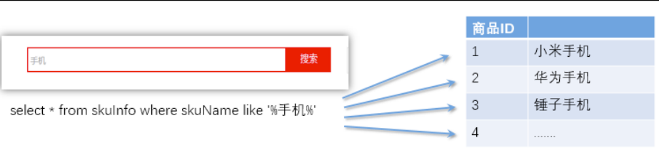

弊端：对于传统的关系性数据库对于关键词的查询，只能逐字逐行的匹配，性能非常差。匹配方式不合理，比如搜索“小密手机” ，如果用 like 进行匹配， 根本匹配不到。但是考虑使用者的用户体验的话，除了完全匹配的记录，还应该显示一部分近似匹配的记录，至少应该匹配到“手机”。

**倒排索引：**全文搜索引擎目前主流的索引技术就是倒排索引的方式。倒排索引的保存数据的方式是 单词→记录：

<center>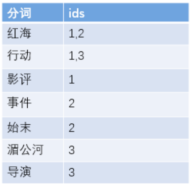</center>

倒排索引有两部分内容组成：

- **单词词典**（Term Dictionary）：记录所有文档的单词，以及单词到倒排列表的关系

  一般具体有 B+ 和哈希拉链发实现

- **倒排列表**（Posting List）：记录单词到此对应的文档集合，由倒排索引项组成。

  倒排索引项：

  - 文档 ID
  - 词频 TF：该单词在文档中出现的次数，相关性评分
  - 位置 - 单词在文档中分词的位置，用于语句搜索。
  - 偏移 - 记录单词的开始和结束位置，高亮显示。

基于分词技术构建倒排索引：

首先每个记录保存数据时，都不会直接存入数据库。系统先会对数据进行分词，然后以倒排索引结构保存。然后等到用户搜索的时候，会把搜索的关键词也进行分词，会把“红海行动”分词分成：红海和行动两个词。这样的话，先用红海进行匹配，得到 id 为 1 和 2 的记录编号，再用行动匹配可以迅速定位 id 为 1,3 的记录。

那么全文索引通常，还会根据匹配程度进行打分，显然 1 号记录能匹配的次数更多。所以显示的时候以评分进行排序的话，1 号记录会排到最前面。而 2、3 号记录也可以匹配到。


#### 索引结构

（1）**B+ tree**

<center>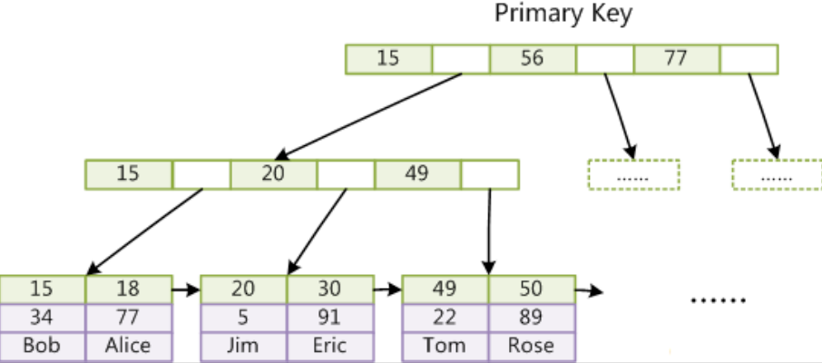</center>

（2）**lucene 倒排索引结构**

<center>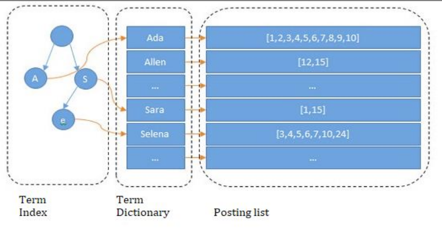</center>

可以看到 lucene 为倒排索引(Term Dictionary)部分又增加一层 Term Index 结构，用于快速定位，而这 Term Index 是缓存在内存中的，但 mysql 的 B+tree 不在内存中，所以整体来看 ES 速度更快，但同时也更消耗资源（内存、磁盘）。 

Term index → Term dictionary → posting list 


#### 天然索引之正排索引( Doc Value列式存储)

倒排索引在搜索包含指定词条的文档时非常高效，但是在相反的操作时表现很差：查询一个文档中包含哪些词条。具体来说，倒排索引在搜索时最为高效，但在排序、聚合等与指定字段相关的操作时效率低下，需要用 doc_values。 

在 Elasticsearch 中，Doc Values 就是一种列式存储结构，默认情况下每个字段的 Doc Values 都是激活的。

索引中某个字段的存储结构如下：

<center>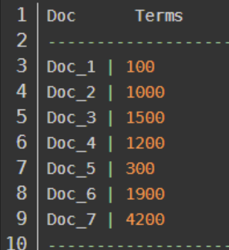</center>

列式存储结构非常适合排序、聚合以及字段相关的脚本操作。而且这种存储方式便于压缩，尤其是数字类型。压缩后能够大大减少磁盘空间，提升访问速度。


### lucene与Elasticsearch的关系

咱们之前讲的处理分词，构建倒排索引，等等，都是这个叫 lucene 的做的。那么能不能说这个 lucene 就是搜索引擎呢？

还不能。lucene 只是一个提供全文搜索功能类库的核心工具包，而真正使用它还需要一个完善的服务框架搭建起来的应用。

好比 lucene 是类似于发动机，而搜索引擎软件（ES,Solr）就是汽车。

目前市面上流行的搜索引擎软件，主流的就两款，elasticsearch 和 solr,这两款都是基于lucene 的搭建的，可以独立部署启动的搜索引擎服务软件。由于内核相同，所以两者除了服务器安装、部署、管理、集群以外，对于数据的操作，修改、添加、保存、查询等等都十分类似。就好像都是支持 sql 语言的两种数据库软件。只要学会其中一个另一个很容易上手。

从实际企业使用情况来看，elasticSearch 的市场份额逐步在取代 solr，国内百度、京东、新浪都是基于 elasticSearch 实现的搜索功能。国外就更多了 像维基百科、GitHub、Stack Overflow 等等也都是基于 ES 的。


## 安装和测试

### es

```bash
docker run -d --name es -p 9200:9200 -p 9300:9300 -e "discovery.type=single-node" elasticsearch:8.3.2
docker cp elasticsearch:/usr/share/elasticsearch/config /opt/module

vim elasticsearch.yml
# 修改为
xpack.security.enabled: false

vim jvm.options
-Xms512m
-Xmx512m

# 运行
docker run --privileged=true --name es -p 9200:9200  -p 9300:9300 \
-e "discovery.type=single-node"  \
-v /opt/module/es/config:/usr/share/elasticsearch/config \
-v /opt/module/es/data:/usr/share/elasticsearch/data \
-v /opt/module/es/plugins:/usr/share/elasticsearch/plugins \
-d elasticsearch:8.3.2
```


### kibana

```bash
docker pull kibana:8.3.2

mkdir  ~/kibana
cd kibana
vim kibana.yml
server.host: "0.0.0.0"
elasticsearch.hosts: ["http://127.0.0.1:9200"]

docker run --privileged=true --name kibana \
 -v ~/kibana/config:/usr/share/kibana/config -p 5601:5601 \
 -d kibana:8.3.2
```

> 这里我发现一个好坑的地方，一定要先启动es，再启动kibana，不然会有问题。


### es测试

1. **命令行进行测试**

   ```bash
   curl http://127.0.0.1:9200
   ```

   ```json
   {
     "name" : "node-1",
     "cluster_name" : "my-es",
     "cluster_uuid" : "JjV4RSntTKKRQnEwCu_45g",
     "version" : {
       "number" : "7.8.0",
       "build_flavor" : "default",
       "build_type" : "tar",
       "build_hash" : "757314695644ea9a1dc2fecd26d1a43856725e65",
       "build_date" : "2020-06-14T19:35:50.234439Z",
       "build_snapshot" : false,
       "lucene_version" : "8.5.1",
       "minimum_wire_compatibility_version" : "6.8.0",
       "minimum_index_compatibility_version" : "6.0.0-beta1"
     },
     "tagline" : "You Know, for Search"
   }
   ```

2. **浏览器进行测试**

   在浏览器地址栏中输入: http://192.168.6.134:9200 进行访问

   ```bash
   // 20220917224759
   // http://192.168.6.134:9200/
   
   {
     "name": "node-1",
     "cluster_name": "my-es",
     "cluster_uuid": "JjV4RSntTKKRQnEwCu_45g",
     "version": {
       "number": "7.8.0",
       "build_flavor": "default",
       "build_type": "tar",
       "build_hash": "757314695644ea9a1dc2fecd26d1a43856725e65",
       "build_date": "2020-06-14T19:35:50.234439Z",
       "build_snapshot": false,
       "lucene_version": "8.5.1",
       "minimum_wire_compatibility_version": "6.8.0",
       "minimum_index_compatibility_version": "6.0.0-beta1"
     },
     "tagline": "You Know, for Search"
   }
   ```

   


### kibana测试

浏览器访问 http://192.168.6.134:5601/


## DSL-基本操作

DSL 全称 Domain Specific language，即特定领域专用语言。

### 基本概念

Elasticsearch也是基于Lucene的全文检索库，本质也是存储数据，很多概念与MySQL类似的。

详细说明：

| 概念                 | 说明                                                         |
| -------------------- | ------------------------------------------------------------ |
| cluster              | 整个 elasticsearch 默认就是集群状态，整个集群是一份完整、互备的数据。 |
| node                 | 集群中的一个节点，一般指一个进程就是一个 node。              |
| shard                | 分片，即使是一个节点中的数据也会通过 hash 算法，分成多个片存放，7.x 默认是 1 片,之前版本默认 5 片。 |
| 副本（replica）      | 每个分片的复制，一般简单的可以一主二从。                     |
| 索引（indices)       | indices是index的复数，代表许多的索引                         |
| Index                | index 相当于 table                                           |
| 类型（type）         | 一种逻辑分区，一个索引下可以有不同类型的索引，比如商品索引，订单索引，其数据格式不同。不过这会导致索引混乱，因此未来版本中会移除这个概念，7.x 版本已经废除，用固定的_doc 占位替代。 |
| 文档（document）     | 存入索引原始的数据，类似于 rdbms 的 row、面向对象里的 object。比如每一条商品信息，就是一个文档。 |
| 字段（field）        | 文档中的属性                                                 |
| 映射配置（mappings） | 字段的数据类型、属性、是否索引、是否存储等特性               |

要注意的是：Elasticsearch本身就是分布式的，因此即便你只有一个节点，Elasticsearch默认也会对你的数据进行分片和副本操作，当你向集群添加新数据时，数据也会在新加入的节点中进行平衡。


### 服务状态查询

#### 参数说明

```bash
GET /_car/health?v&format=json
```

- v:显示表头
- help:显示命令返回的参数说明
- h:指定要显示的列， GET _cat/count?h=epoch
- format:设 置 要 返 回 的 内 容 格 式 json,yml,txt 等 ， GET _cat/count?format=json
- s:指定排序，GET _cat/indices?v&s=docs.count:desc
- &:拼接多个参数，GET _cat/count?v&h=epoch


#### 服务整体状态查询

```bash
GET /_cat/health?v
```

```bash
epoch      timestamp cluster status node.total node.data shards pri relo init unassign pending_tasks max_task_wait_time active_shards_percent
1663450044 21:27:24  my-es   yellow          1         1      9   9    0    0        1             0                  -                 90.0%
```

- epoch:从标准时间(1970-01-01 00:00:00)以来的秒数

- timestamp:时分秒，utc 时区

- cluster:集群名称

- status:集群状态

  green:代表健康，主分片都正常并且至少有一个副本

  yellow:分配了所有主分片，至少缺少一个副本，集群数据仍旧完整

  red: 代表部分主分片不可用，可能已经丢失数据

- node.total:在线的节点总数量

- node.data:在线的数据节点总数量

- shards:存活的分片数量

- pri:存活的主分片数量

- relo:迁移中的分片数量

- init:初始化中的分片数量

- unassign:未分配的分片数量

- pending_tasks :准备中的任务，例如迁移分片等

- max_task_wait_time:任务最长等待时间

- active_shards_percent :存活的分片百分比


#### 查询各个节点状态

```bash
GET /_cat/nodes?v
```

```bash
ip         heap.percent ram.percent cpu load_1m load_5m load_15m node.role   master name
172.17.0.4           39          97   6    0.24    0.85     0.86 cdfhilmrstw *      586f95af9d5b
```

- ip:节点 ip
- heap.percent:堆内存占用百分比
- ram.percent:内存占用百分比
- cpu:cpu 占用百分比
- load_1m:1 分钟的系统负载
- load_5m:5 分钟的系统负载
- load_15m:15 分钟的系统负载
- node.role:节点的角色
- master:是否是 master 节点
- name:节点名称


#### 查询各个索引状态

```bash
GET /_cat/indices?v
```

```bash
health status index       uuid                   pri rep docs.count docs.deleted store.size pri.store.size
yellow open   movie_index E8Ci5elaQ8C52WvszAStBQ   1   1          1            0      5.7kb          5.7kb
```

- health:索引的健康状态
- status:索引的开启状态
- index:索引名
- uuid:索引的 uuid
- pri:索引主分片数量
- rep:索引副本分片数量
- docs.count:索引中文档总数
- docs.deleted:索引中删除状态的文档数
- store.size:索引主分片与副本分片总占用存储空间
- pri.store.size:索引主分片占用空间


#### 查询某个索引的分片情况

```bash
GET /_cat/shards/xxxx
```

```bash
index       shard prirep state      docs store ip         node
movie_index 0     p      STARTED       1 5.7kb 172.17.0.4 586f95af9d5b
movie_index 0     r      UNASSIGNED      
```

- index:索引名称
- shard:shard 分片序号
- prirep:主分片 or 副本分片，p 表示主分片，r 表示副本分片
- state:分片状态
- docs:该分片存放的文档数
- store:该分片占用的存储空间
- ip:该分片所在的服务器 ip
- node:该分片所在的节点名称


#### 显示各个节点分片情况

```bash
GET _cat/allocation?v
```

```bash
shards disk.indices disk.used disk.avail disk.total disk.percent host       ip         node
     9          3mb    13.1gb      3.2gb     16.4gb           79 172.17.0.4 172.17.0.4 586f95af9d5b
     1                                                                                 UNASSIGNED
```

- shards:节点承载的分片数量
- disk.indices:索引占用的空间大小
- disk.used:节点所在机器已使用的磁盘空间大小
- disk.avail:节点可用空间大小
- disk.total:节点总空间大小
- disk.percent:节点磁盘占用百分比
- host:节点 host
- ip:节点 ip 
- node:节点名称


#### 显示索引文档总数

```bash
GET _cat/count?v
```

```bash
epoch      timestamp count
1663452107 22:01:47  1
```

- epoch:自标准时间(1970-01-01 00:00:00) 以来的秒数
- timestamp:时分秒，utc 时区
- count:文档总数

> 这里好像显示的所有索引的文档。


### 操作索引

#### 创建索引

##### 语法

Elasticsearch采用Rest风格API，因此其API就是一次http请求，你可以用任何工具发起http请求。

创建索引的请求格式：

- 请求方式：PUT
- 请求路径：/索引名
- 请求参数：json格式

简单的创建索引(之后根据插入的数据自动配置)：
```bash
put /movie_index_cn
```

进行映射配置的创建：

```json
PUT movie_index_cn
{
    "settings": {
        "number_of_shards": 3,
        "number_of_replicas": 2
    },
    "mappings": {
        "properties": {
            "id":{
                "type": "long"
            },
            "name":{
                "type": "text"
                , "analyzer": "ik_smart" //分词器
            },
            "doubanScore":{
                "type": "double"
            },
            "actorList":{
                "properties": {
                    "id":{
                        "type":"long"
                    },
                    "name":{
                        "type":"keyword"
                    }
                }
            }
        } 
    }
}
```

- settings：索引的设置
  - number_of_shards：分片数量
  - number_of_replicas：副本数量
  
- ```bash
  "properties": {
      "字段名": {
        "type": "类型",
        "index": true，
        "store": true，
        "analyzer": "分词器"
      }
    }
  ```
  
  - type：类型，可以是text、long、short、date、integer、object等
  - index：是否索引，默认为true
  - store：是否存储，默认为false
  - analyzer：分词器，这里的`ik_max_word`即使用ik分词器


##### 映射字段属性详解

###### type

Elasticsearch中支持的数据类型非常丰富：


我们说几个关键的：

- String类型，又分两种：

  - text：可分词，不可参与聚合
  - keyword：不可分词，数据会作为完整字段进行匹配，可以参与聚合

- Numerical：数值类型，分两类

  - 基本数据类型：long、interger、short、byte、double、float、half_float
  - 浮点数的高精度类型：scaled_float
    - 需要指定一个精度因子，比如10或100。elasticsearch会把真实值乘以这个因子后存储，取出时再还原。

- Date：日期类型

  elasticsearch可以对日期格式化为字符串存储，但是建议我们存储为毫秒值，存储为long，节省空间。


###### index

index影响字段的索引情况。

- true：字段会被索引，则可以用来进行搜索。默认值就是true
- false：字段不会被索引，不能用来搜索

index的默认值就是true，也就是说你不进行任何配置，所有字段都会被索引。

但是有些字段是我们不希望被索引的，比如商品的图片信息，就需要手动设置index为false。


###### store

是否将数据进行额外存储。

在学习lucene和solr时，我们知道如果一个字段的store设置为false，那么在文档列表中就不会有这个字段的值，用户的搜索结果中不会显示出来。

但是在Elasticsearch中，即便store设置为false，也可以搜索到结果。

原因是Elasticsearch在创建文档索引时，会将文档中的原始数据备份，保存到一个叫做`_source`的属性中。而且我们可以通过过滤`_source`来选择哪些要显示，哪些不显示。

而如果设置store为true，就会在`_source`以外额外存储一份数据，多余，因此一般我们都会将store设置为false，事实上，**store的默认值就是false。**


###### boost

激励因子，这个与lucene中一样

其它的不再一一讲解，用的不多，参考官方文档：


##### 测试

我们先用postman来试试


可以看到索引创建成功了。


##### 使用


kibana的控制台，可以对http请求进行简化，示例：


相当于是省去了elasticsearch的服务器地址

而且还有语法提示，非常舒服。


#### 查看索引

> 语法

Get请求可以帮我们查看索引信息，格式：

```java
GET /索引名
```


或者，我们可以使用*来查询所有索引配置：


#### 删除索引

删除索引使用DELETE请求

> 语法

```java
DELETE /索引名
```

> 示例


当然，我们也可以用HEAD请求，查看索引是否存在：


#### 查看索引结构

```bash
GET movie_index/_mapping
```

```bash
{
  "movie_index": {
    "mappings": {
      "properties": {
        "actorList": {
          "properties": {
            "id": {
              "type": "long"
            },
            "name": {
              "type": "text",
              "fields": {
                "keyword": {
                  "type": "keyword",
                  "ignore_above": 256
                }
              }
            }
          }
        },
        "doubanScore": {
          "type": "float"
        },
        "id": {
          "type": "long"
        },
        "name": {
          "type": "text",
          "fields": {
            "keyword": {
              "type": "keyword",
              "ignore_above": 256
            }
          }
        }
      }
    }
  }
}
```

这里注意一下，字符串有两种格式：

- 一种是倒排索引方式(text 类型)，用于分词匹配；
- 一种是标准列式存储(keyword 类型)，用于过滤 ，分组，聚合，排序…. ，需要加 keyword。 


### 新增数据

#### 随机生成id-非幂等

通过POST请求，可以向一个已经存在的索引中添加数据。

> 语法：

```json
POST /movie_index/_doc
{
    "id":3,
    "name":"incident red sea",
    "doubanScore":5.0,
    "actorList":[
        {"id":4,"name":"atguigu"}
    ]
}
```

通过kibana查看数据：

```bash
GET movie_index/_doc/3
```

```json
{
  "_index": "movie_index",
  "_id": "3",
  "_version": 3,
  "_seq_no": 5,
  "_primary_term": 1,
  "found": true,
  "_source": {
    "id": "3",
    "name": "incident red sea",
    "doubanScore": 7,
    "actorList": [
      {
        "id": "1",
        "name": "shangguigu"
      }
    ]
  }
}
```

- `_source`：源文档信息，所有的数据都在里面。
- `_id`：这条文档的唯一标示，与文档自己的id字段没有关联


#### 自定义id-幂等

如果我们想要自己新增的时候指定id，可以这么做：

```json
PUT /movie_index/_doc/2
{
    "id":2,
    "name":"operation meigong river",
    "doubanScore":8.0,
    "actorList":[ 
        {"id":3,"name":"zhang han yu"}
    ]
}
```


#### 智能判断

在学习Solr时我们发现，我们在新增数据时，只能使用提前配置好映射属性的字段，否则就会报错。

不过在Elasticsearch中并没有这样的规定。

事实上Elasticsearch非常智能，你不需要给索引设置任何mapping映射，它也可以根据你输入的数据来判断类型，动态添加数据映射。

测试一下：

```json
put /heima/goods/3
{
    "goods": {
        "title":"超米手机",
        "images":"http://image.leyou.com/12479122.jpg",
        "price":2899.00,
        "stock": 200,
        "saleable":true
    }
}
```

我们额外添加了stock库存，和saleable是否上架两个字段。

来看结果：

```json
{
  "_index": "test_store",
  "_type": "goods",
  "_id": "3",
  "_version": 1,
  "_score": 1,
  "_source": {
    "title": "超米手机",
    "images": "http://image.leyou.com/12479122.jpg",
    "price": 2899,
    "stock": 200,
    "saleable": true
  }
}
```

在看下索引的映射关系:

```json
{
  "test_store" : {
    "mappings" : {
      "properties" : {
        "goods" : {
          "properties" : {
            "images" : {
              "type" : "keyword",
              "index" : false
            },
            "price" : {
              "type" : "float"
            },
            "saleable" : {
              "type" : "boolean"
            },
            "stock" : {
              "type" : "long"
            },
            "title" : {
              "type" : "text",
              "analyzer" : "ik_max_word"
            }
          }
        }
      }
    }
  }
}
```

stock和saleable都被成功映射了。


### 修改数据

**请求方式为PUT，则为完整替代**，指定id

- id对应文档存在，则修改
- id对应文档不存在，则新增

**请求方式为POST，则可以指定字段替代**。

比如，我们把id为5的数据进行修改：

```java
PUT /movie_index/_doc/3
{
    "id":"3",
    "name":"incident red sea",
    "doubanScore":5.0,
    "actorList":[ 
        {"id":"1","name":"shangguigu"}
    ]
}
```

```java
POST movie_index/_update/3
{ 
    "doc": {
        "doubanScore":7.0
    } 
}
```

也可以进行过滤修改：

```json
POST movie_index/_update_by_query
{
    "query": {
        "term": {
            "actorList.name": {
                "value": "atguigu"
            }
        }
    } 
    ,
    "script": {
        "source": "ctx._source['actorList'][0]['name']=params.newName",
        "params": {
            "newName":"shangguigu"
        }, 
        "lang": "painless"
    }
}
```


### 删除数据

删除使用DELETE请求，同样，需要根据id进行删除：

```
DELETE movie_index/_doc/3
```

也可以进行过滤删除：

```json
POST movie_index/_delete_by_query
{
    "query":{
        "term":{
            "actorList.name":"atguigu"
        }
    } 
}
```


## DSL-查询数据

我们从4块来讲查询：

- 基本查询
- `_source`过滤
- 结果过滤
- 高级查询
- 排序


### 简单查询

查询索引所有文档：

```bash
GET movie_index/_search
```

查询一个文档：

```bash
GET movie_index/_doc/3
```


### 基本查询

> 基本语法

```json
GET /索引名/_search
{
    "query":{
        "查询类型":{
            "查询条件":"查询条件值"
        }
    }
}
```

这里的query代表一个查询对象，里面可以有不同的查询属性

- 查询类型：
  - 例如：`match_all`， `match`，`term` ， `range` 等等
- 查询条件：查询条件会根据类型的不同，写法也有差异，后面详细讲解


#### 查询所有

> 示例：

```java
GET  /heima/_search
{
  "query": {
    "match_all": {}
  }
}
```

- `query`：代表查询对象
- `match_all`：代表查询所有

```json
{
  "took": 2,
  "timed_out": false,
  "_shards": {
    "total": 1,
    "successful": 1,
    "skipped": 0,
    "failed": 0
  },
  "hits": {
    "total": 5,
    "max_score": 1,
    "hits": [
      {
        "_index": "heima",
        "_type": "goods",
        "_id": "1",
        "_score": 1,
        "_source": {
          "title": "大米手机",
          "images": "http://image.leyou.com/154.jpg",
          "price": 2799,
          "saleable": true
        }
      },
      {
        "_index": "heima",
        "_type": "goods",
        "_id": "2",
        "_score": 1,
        "_source": {
          "title": "大米手机",
          "images": "http://image.leyou.com/154.jpg",
          "price": 2799,
          "saleable": true
        }
      }
    ]
  }
}
```

- `took`：查询花费时间，单位是毫秒

- `time_out`：是否超时

- `_shards`：分片信息

- ```
  hits
  ```

  ：搜索结果总览对象

  - `total`：搜索到的总条数

  - `max_score`：所有结果中文档得分的最高分

  - ```
    hits
    ```

    ：搜索结果的文档对象数组，每个元素是一条搜索到的文档信息

    - `_index`：索引
    - `_type`：文档类型
    - `_id`：文档id
    - `_score`：文档得分
    - `_source`：文档的源数据

评分公式：

<center>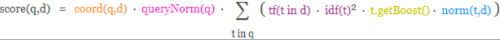</center>

根据匹配的程度，会影响数据的相关度评分，而相关度评分会影响默认排名。

- 正向因素 ：命中次数、 命中长度比例。
- 负面因素： 关键词在该字段的其他词条中出现的次数。


####   匹配查询

```json
GET /heima/_search
{
  "query": {
    "match": {
      "title": {
        "query": "小米电视手机",
      }
    }
  }
}
```

- or关系

`match`类型查询，会把查询条件进行分词，然后进行查询,多个词条之间是or的关系

```json
GET /heima/_search
{
  "query": {
    "match": {
      "goods.title": "小米电视"
    }
  }
}
```

结果：

```json
"hits": {
    "total": 2,
    "max_score": 0.6931472,
    "hits": [
        {
            "_index": "test_store",
            "_type": "goods",
            "_id": "tmUBomQB_mwm6wH_EC1-",
            "_score": 0.6931472,
            "_source": {
                "title": "小米手机",
                "images": "http://image.leyou.com/12479122.jpg",
                "price": 2699
            }
        },
        {
            "_index": "test_store",
            "_type": "goods",
            "_id": "3",
            "_score": 0.5753642,
            "_source": {
                "title": "小米电视4A",
                "images": "http://image.leyou.com/12479122.jpg",
                "price": 3899
            }
        }
    ]
}
```

在上面的案例中，不仅会查询到电视，而且与小米相关的都会查询到，多个词之间是`or`的关系。

- and关系

某些情况下，我们需要更精确查找，我们希望这个关系变成`and`，也就是分词后多个词条之间是or的关系：

```json
GET /heima/_search
{
  "query": {
    "match": {
      "goods.title": {
        "query": "小米电视",
        "operator": "and"
      }
    }
  }
}
```

结果：

```json
{
  "took": 2,
  "timed_out": false,
  "_shards": {
    "total": 3,
    "successful": 3,
    "skipped": 0,
    "failed": 0
  },
  "hits": {
    "total": 1,
    "max_score": 0.5753642,
    "hits": [
      {
        "_index": "test_store",
        "_type": "goods",
        "_id": "3",
        "_score": 0.5753642,
        "_source": {
          "title": "小米电视4A",
          "images": "http://image.leyou.com/12479122.jpg",
          "price": 3899
        }
      }
    ]
  }
}
```

本例中，只有同时包含`小米`和`电视`的词条才会被搜索到。

- or和and之间？

在 `or` 与 `and` 间二选一有点过于非黑即白。 如果用户给定的条件分词后有 5 个查询词项，想查找只包含其中 4 个词的文档，该如何处理？将 operator 操作符参数设置成 `and` 只会将此文档排除。

有时候这正是我们期望的，但在全文搜索的大多数应用场景下，我们既想包含那些可能相关的文档，同时又排除那些不太相关的。换句话说，我们想要处于中间某种结果。

`match` 查询支持 `minimum_should_match` 最小匹配参数， 这让我们可以指定必须匹配的词项数用来表示一个文档是否相关。我们可以将其设置为某个具体数字，更常用的做法是将其设置为一个`百分数`，因为我们无法控制用户搜索时输入的单词数量：

```json
GET /heima/_search
{
  "query": {
    "match": {
      "goods.title": {
        "query": "小米曲面电视",
        "minimum_should_match": "75%"
      }
    }
  }
}
```

本例中，搜索语句可以分为3个词，如果使用and关系，需要同时满足3个词才会被搜索到。这里我们采用最小品牌数：75%，那么也就是说只要匹配到总词条数量的75%即可，这里3*75% 约等于2。所以只要包含2个词条就算满足条件了。

结果：


#### 多字段查询（multi_match）

`multi_match`与`match`类似，不同的是它可以在多个字段中查询

```json
GET heima/_search
{
 "query": {
   "multi_match": {
     "query": "小米",
     "fields": ["title","subtitle"]
   }
 } 
}
```

新增一条记录

```json
POST /heima/goods
{
  "goods": {
    "title":"华为手机",
    "subTitle":"小米是小虾米",
    "images":"http://image.leyou.com/12479122.jpg",
    "price":2699.00
  }
}
```

本例中，我们会在title字段和subtitle字段中查询`小米`这个词


#### 词条匹配(term)

`term` 查询被用于精确值 匹配，这些精确值可能是数字、时间、布尔或者那些**未分词**的字符串

```json
GET  heima/_search
{
  "query": {
    "term": {
      "title": {
        "value": "小米"
      }
    }
  }
}
```

结果：

```json
{
  "took": 1,
  "timed_out": false,
  "_shards": {
    "total": 1,
    "successful": 1,
    "skipped": 0,
    "failed": 0
  },
  "hits": {
    "total": 2,
    "max_score": 1.0630728,
    "hits": [
      {
        "_index": "heima",
        "_type": "goods",
        "_id": "4",
        "_score": 1.0630728,
        "_source": {
          "title": "小米手机",
          "images": "http://image.leyou.com/154.jpg",
          "price": 3099,
          "saleable": true
        }
      },
      {
        "_index": "heima",
        "_type": "goods",
        "_id": "5",
        "_score": 1.0630728,
        "_source": {
          "title": "小米电视",
          "images": "http://image.leyou.com/154.jpg",
          "price": 1099,
          "saleable": true
        }
      }
    ]
  }
}
```


#### 多词条精确匹配(terms)

`terms` 查询和 term 查询一样，但它允许你指定多值进行匹配。如果这个字段包含了指定值中的任何一个值，那么这个文档满足条件：

```json
GET /heima/_search
{
  "query": {
    "terms": {
      "title": [
        "小米",
        "华为"
      ]
    }
  } 
}
```

结果：

```json
{
  "took": 1,
  "timed_out": false,
  "_shards": {
    "total": 1,
    "successful": 1,
    "skipped": 0,
    "failed": 0
  },
  "hits": {
    "total": 3,
    "max_score": 1,
    "hits": [
      {
        "_index": "heima",
        "_type": "goods",
        "_id": "4",
        "_score": 1,
        "_source": {
          "title": "小米手机",
          "images": "http://image.leyou.com/154.jpg",
          "price": 3099,
          "saleable": true
        }
      },
      {
        "_index": "heima",
        "_type": "goods",
        "_id": "5",
        "_score": 1,
        "_source": {
          "title": "小米电视",
          "images": "http://image.leyou.com/154.jpg",
          "price": 1099,
          "saleable": true
        }
      },
      {
        "_index": "heima",
        "_type": "goods",
        "_id": "6",
        "_score": 1,
        "_source": {
          "title": "华为手机",
          "subtitle": "小米",
          "images": "http://image.leyou.com/154.jpg",
          "price": 1099,
          "saleable": true
        }
      }
    ]
  }
}{
  "took": 1,
  "timed_out": false,
  "_shards": {
    "total": 1,
    "successful": 1,
    "skipped": 0,
    "failed": 0
  },
  "hits": {
    "total": 2,
    "max_score": 1.1631508,
    "hits": [
      {
        "_index": "heima",
        "_type": "goods",
        "_id": "4",
        "_score": 1.1631508,
        "_source": {
          "title": "小米手机",
          "images": "http://image.leyou.com/154.jpg",
          "price": 3099,
          "saleable": true
        }
      },
      {
        "_index": "heima",
        "_type": "goods",
        "_id": "5",
        "_score": 1.1631508,
        "_source": {
          "title": "小米电视",
          "images": "http://image.leyou.com/154.jpg",
          "price": 1099,
          "saleable": true
        }
      }
    ]
  }
}
```


### 结果过滤-直接指定字段

默认情况下，elasticsearch在搜索的结果中，会把文档中保存在`_source`的所有字段都返回。

如果我们只想获取其中的部分字段，我们可以添加`_source`的过滤

示例：

```json
GET /heima/_search
{
  "_source": ["title"], 
  "query": {
    "terms": {
      "title": [
        "小米",
        "华为"
      ]
    }
  }
  
}
```

返回的结果：

```json
{
  "took": 2,
  "timed_out": false,
  "_shards": {
    "total": 1,
    "successful": 1,
    "skipped": 0,
    "failed": 0
  },
  "hits": {
    "total": 3,
    "max_score": 1,
    "hits": [
      {
        "_index": "heima",
        "_type": "goods",
        "_id": "4",
        "_score": 1,
        "_source": {
          "title": "小米手机"
        }
      },
      {
        "_index": "heima",
        "_type": "goods",
        "_id": "5",
        "_score": 1,
        "_source": {
          "title": "小米电视"
        }
      },
      {
        "_index": "heima",
        "_type": "goods",
        "_id": "6",
        "_score": 1,
        "_source": {
          "title": "华为手机"
        }
      }
    ]
  }
}
```


>  指定includes和excludes

我们也可以通过：

- includes：来指定想要显示的字段
- excludes：来指定不想要显示的字段

二者都是可选的。

示例：

```json
GET /heima/_search
{
  "_source": {
    "excludes": ["title"],
    "includes": ["images"]
    }, 
  "query": {
    "terms": {
      "title": [
        "小米",
        "华为"
      ]
    }
  }
}
```

```json
{
  "took": 1,
  "timed_out": false,
  "_shards": {
    "total": 1,
    "successful": 1,
    "skipped": 0,
    "failed": 0
  },
  "hits": {
    "total": 3,
    "max_score": 1,
    "hits": [
      {
        "_index": "heima",
        "_type": "goods",
        "_id": "4",
        "_score": 1,
        "_source": {
          "images": "http://image.leyou.com/154.jpg",
          "price": 3099
        }
      },
      {
        "_index": "heima",
        "_type": "goods",
        "_id": "5",
        "_score": 1,
        "_source": {
          "images": "http://image.leyou.com/154.jpg",
          "price": 1099
        }
      },
      {
        "_index": "heima",
        "_type": "goods",
        "_id": "6",
        "_score": 1,
        "_source": {
          "images": "http://image.leyou.com/154.jpg",
          "price": 1099
        }
      }
    ]
  }
}
```


### 高级查询

#### 布尔查询(bool)-组合查询

`bool`把各种其它查询通过`must`（与）、`must_not`（非）、`should`（或）的方式进行组合，还可以使用filter对结果进行过滤。

must 和 should 的区别： must 是必须有，should 在有其他条件命中的情况下，should 命中给分并显示，如果 should 未命中则只显示不给分。

filter必须满足。

```json
GET heima/_search
{
  "query": {
    "bool": {
      "should": [
        {
          "match": {
            "title": "小米"
          }
        },
        {
          "terms": {
            "price": [
              "1099",
              "3099"
            ]
          }
        }
      ],
      "must": [
        {
          "term": {
            "saleable": {
              "value": "true"
            }
          }
        }
      ]
    }
    
  }
}
```

```json
{
  "took": 3,
  "timed_out": false,
  "_shards": {
    "total": 1,
    "successful": 1,
    "skipped": 0,
    "failed": 0
  },
  "hits": {
    "total": 7,
    "max_score": 2.2276893,
    "hits": [
      {
        "_index": "heima",
        "_type": "goods",
        "_id": "4",
        "_score": 2.2276893,
        "_source": {
          "title": "小米手机",
          "images": "http://image.leyou.com/154.jpg",
          "price": 3099,
          "saleable": true
        }
      },
      {
        "_index": "heima",
        "_type": "goods",
        "_id": "5",
        "_score": 2.2276893,
        "_source": {
          "title": "小米电视",
          "images": "http://image.leyou.com/154.jpg",
          "price": 1099,
          "saleable": true
        }
      },
      {
        "_index": "heima",
        "_type": "goods",
        "_id": "6",
        "_score": 1.0645385,
        "_source": {
          "title": "华为手机",
          "subtitle": "小米",
          "images": "http://image.leyou.com/154.jpg",
          "price": 1099,
          "saleable": true
        }
      },
      {
        "_index": "heima",
        "_type": "goods",
        "_id": "7",
        "_score": 1.0645385,
        "_source": {
          "title": "小",
          "subtitle": "小",
          "images": "http://image.leyou.com/154.jpg",
          "price": 1099,
          "saleable": true
        }
      },
      {
        "_index": "heima",
        "_type": "goods",
        "_id": "1",
        "_score": 0.06453852,
        "_source": {
          "title": "大米手机",
          "images": "http://image.leyou.com/154.jpg",
          "price": 2799,
          "saleable": true
        }
      },
      {
        "_index": "heima",
        "_type": "goods",
        "_id": "2",
        "_score": 0.06453852,
        "_source": {
          "title": "大米手机",
          "images": "http://image.leyou.com/154.jpg",
          "price": 2799,
          "saleable": true
        }
      },
      {
        "_index": "heima",
        "_type": "goods",
        "_id": "3",
        "_score": 0.06453852,
        "_source": {
          "title": "中米手机",
          "images": "http://image.leyou.com/154.jpg",
          "price": 2099,
          "saleable": true
        }
      }
    ]
  }
}
```


#### 范围查询(range)

`range` 查询找出那些落在指定区间内的数字或者时间

```json
# 范围查询

GET heima/_search
{
  "query": {
    "range": {
      "price": {
        "gte": 2300,
        "lte": 4000
      }
    }
  } 
}
```

`range`查询允许以下字符：

| 操作符 | 说明     |
| ------ | -------- |
| gt     | 大于     |
| gte    | 大于等于 |
| lt     | 小于     |
| lte    | 小于等于 |


#### 模糊查询（fuzzy）

`fuzzy` 查询是 `term` 查询的模糊等价。它`允许用户搜索词条与实际词条的拼写出现偏差`，但是偏差的编辑距离不得超过2：

```json
# 模糊查询 
GET heima/_search
{
  "query": {
    "fuzzy": {
      "title": {
        "value": "小米手"
      }
    }
  }
  
}
```

```json
{
  "took": 2,
  "timed_out": false,
  "_shards": {
    "total": 1,
    "successful": 1,
    "skipped": 0,
    "failed": 0
  },
  "hits": {
    "total": 2,
    "max_score": 0.5815754,
    "hits": [
      {
        "_index": "heima",
        "_type": "goods",
        "_id": "4",
        "_score": 0.5815754,
        "_source": {
          "title": "小米手机",
          "images": "http://image.leyou.com/154.jpg",
          "price": 3099,
          "saleable": true
        }
      },
      {
        "_index": "heima",
        "_type": "goods",
        "_id": "5",
        "_score": 0.5815754,
        "_source": {
          "title": "小米电视",
          "images": "http://image.leyou.com/154.jpg",
          "price": 1099,
          "saleable": true
        }
      }
    ]
  }
}
```


我们可以通过`fuzziness`来指定允许的编辑距离：

```json
# 模糊查询 
GET heima/_search
{
  "query": {
    "fuzzy": {
      "title": {
        "value": "小米手",
        "fuzziness": 2
      }
    }
  }
  
}
```

```json
{
  "took": 6,
  "timed_out": false,
  "_shards": {
    "total": 1,
    "successful": 1,
    "skipped": 0,
    "failed": 0
  },
  "hits": {
    "total": 6,
    "max_score": 0.5815754,
    "hits": [
      {
        "_index": "heima",
        "_type": "goods",
        "_id": "4",
        "_score": 0.5815754,
        "_source": {
          "title": "小米手机",
          "images": "http://image.leyou.com/154.jpg",
          "price": 3099,
          "saleable": true
        }
      },
      {
        "_index": "heima",
        "_type": "goods",
        "_id": "5",
        "_score": 0.5815754,
        "_source": {
          "title": "小米电视",
          "images": "http://image.leyou.com/154.jpg",
          "price": 1099,
          "saleable": true
        }
      },
      {
        "_index": "heima",
        "_type": "goods",
        "_id": "1",
        "_score": 0,
        "_source": {
          "title": "大米手机",
          "images": "http://image.leyou.com/154.jpg",
          "price": 2799,
          "saleable": true
        }
      },
      {
        "_index": "heima",
        "_type": "goods",
        "_id": "2",
        "_score": 0,
        "_source": {
          "title": "大米手机",
          "images": "http://image.leyou.com/154.jpg",
          "price": 2799,
          "saleable": true
        }
      },
      {
        "_index": "heima",
        "_type": "goods",
        "_id": "3",
        "_score": 0,
        "_source": {
          "title": "中米手机",
          "images": "http://image.leyou.com/154.jpg",
          "price": 2099,
          "saleable": true
        }
      },
      {
        "_index": "heima",
        "_type": "goods",
        "_id": "7",
        "_score": 0,
        "_source": {
          "title": "小",
          "subtitle": "小",
          "images": "http://image.leyou.com/154.jpg",
          "price": 1099,
          "saleable": true
        }
      }
    ]
  }
}
```


#### 过滤(filter)

> **条件查询中进行过滤**

所有的查询都会影响到文档的评分及排名。如果我们需要在查询结果中进行过滤，并且不希望过滤条件影响评分，那么就不要把过滤条件作为查询条件来用。而是使用`filter`方式

```json
# filter
GET  heima/_search
{
  "query": {
    "bool": {
      "must": [
        {
          "match": {
            "title": "手机"
          }
        }
      ],
      "filter": {
        "range": {
          "price": {
            "gte": 2699,
            "lte": 3099
          }
        }
      }
    }
  }
}
```


注意：`filter`中还可以再次进行`bool`组合条件过滤。

> **无查询条件，直接过滤**

如果一次查询只有过滤，没有查询条件，不希望进行评分，我们可以使用`constant_score`取代只有 filter 语句的 bool 查询。在性能上是完全相同的，但对于提高查询简洁性和清晰度有很大帮助。


```json
# filter
GET  heima/_search
{
  "query": {
    "bool": {
      "filter": {
        "range": {
          "price": {
            "gte": 2699,
            "lte": 3099
          }
        }
      }
    }
  }
}
```

`此刻评分为0`


### 排序

`sort` 可以让我们按照不同的字段进行排序，并且通过`order`指定排序的方式。

可以`单字段排序`也可以`多字段排序`。

> 多字段排序如果第一个字段相同，会按照第二个字段排序

```json
# filter和sort
GET  heima/_search
{
  "query": {
    "bool": {
      "must": [
        {
          "match": {
            "title": "手机"
          }
        }
      ],
      "filter": {
        "range": {
          "price": {
            "gte": 2699,
            "lte": 3099
          }
        }
      }
    }
  },
  "sort": [
    {
      "price": {
        "order": "desc"
      },
      "_id": {
        "order": "asc"
      }
    }
  ]
}
```

```json
{
  "took": 35,
  "timed_out": false,
  "_shards": {
    "total": 1,
    "successful": 1,
    "skipped": 0,
    "failed": 0
  },
  "hits": {
    "total": 3,
    "max_score": null,
    "hits": [
      {
        "_index": "heima",
        "_type": "goods",
        "_id": "4",
        "_score": null,
        "_source": {
          "title": "小米手机",
          "images": "http://image.leyou.com/154.jpg",
          "price": 3099,
          "saleable": true
        },
        "sort": [
          3099,
          "4"
        ]
      },
      {
        "_index": "heima",
        "_type": "goods",
        "_id": "1",
        "_score": null,
        "_source": {
          "title": "大米手机",
          "images": "http://image.leyou.com/154.jpg",
          "price": 2799,
          "saleable": true
        },
        "sort": [
          2799,
          "1"
        ]
      },
      {
        "_index": "heima",
        "_type": "goods",
        "_id": "2",
        "_score": null,
        "_source": {
          "title": "大米手机",
          "images": "http://image.leyou.com/154.jpg",
          "price": 2799,
          "saleable": true
        },
        "sort": [
          2799,
          "2"
        ]
      }
    ]
  }
}
```


### 分页

```json
GET movie_index/_search
{
    "query": {
        "match_all": {}
    }
    , 
    "from": 2 // 从哪行开始，需要通过页码进行计算 (pageNum - 1) * size 
    , 
    "size": 2
}
```


### 高亮

用于在网页中通过特殊标签来高亮显示结果中的关键字。

```json
GET movie_index/_search
{
    "query": {
        "match": {
            "name": "red"
        }
    }, 
    "highlight": {
        "fields": {
            "name": {
                "pre_tags": "<font color='red'>",
                "post_tags": "</font>"
            }
        }
    } 
}
```

就是在关键字前后加上tags。


### 聚合aggregations

聚合可以让我们极其方便的实现对数据的统计、分析。例如：

- 什么品牌的手机最受欢迎？
- 这些手机的平均价格、最高价格、最低价格？
- 这些手机每月的销售情况如何？

实现这些统计功能的比数据库的sql要方便的多，而且查询速度非常快，可以实现实时搜索效果。


#### 基本概念

Elasticsearch中的聚合，包含多种类型，最常用的两种，一个叫`桶`，一个叫`度量`：

> **桶（bucket）**

桶的作用，是按照某种方式对数据进行分组，每一组数据在ES中称为一个`桶`，例如我们根据国籍对人划分，可以得到`中国桶`、`英国桶`，`日本桶`……或者我们按照年龄段对人进行划分：0~~10,10~~20,20~~30,30~~40等。

Elasticsearch中提供的划分桶的方式有很多：

- Date Histogram Aggregation：根据日期阶梯分组，例如给定阶梯为周，会自动每周分为一组
- Histogram Aggregation：根据数值阶梯分组，与日期类似
- Terms Aggregation：根据词条内容分组，词条内容完全匹配的为一组
- Range Aggregation：数值和日期的范围分组，指定开始和结束，然后按段分组
- ……

bucket aggregations 只负责对数据进行分组，并不进行计算，因此往往bucket中往往会嵌套另一种聚合：metrics aggregations即度量

> **度量（metrics）**

分组完成以后，我们一般会对组中的数据进行聚合运算，例如求平均值、最大、最小、求和等，这些在ES中称为`度量`

比较常用的一些度量聚合方式：

- Avg Aggregation：求平均值
- Max Aggregation：求最大值
- Min Aggregation：求最小值
- Percentiles Aggregation：求百分比
- Stats Aggregation：同时返回avg、max、min、sum、count等
- Sum Aggregation：求和
- Top hits Aggregation：求前几
- Value Count Aggregation：求总数
- ……

为了测试聚合，我们先批量导入一些数据

创建索引：

```json
PUT /cars
{
  "settings": {
    "number_of_replicas": 0,
    "number_of_shards": 1
  },
  "mappings": {
    "transactions": {
      "properties": {
        "color": {
          "type": "keyword"
        },
        "make": {
          "type": "keyword"
        }
      }
    }
  }
}
```

> **注意**：在ES中，需要进行聚合、排序、过滤的字段其处理方式比较特殊，因此不能被分词。这里我们将color和make这两个文字类型的字段设置为keyword类型，这个类型不会被分词，将来就可以参与聚合

导入数据

```json
POST /cars/transactions/_bulk
{ "index": {}}
{ "transactions":{"price" : 10000, "color" : "red", "make" : "honda", "sold" : "2014-10-28" }}
{ "index": {}}
{ "transactions":{"price" : 20000, "color" : "red", "make" : "honda", "sold" : "2014-11-05" }}
{ "index": {}}
{ "transactions":{"price" : 30000, "color" : "green", "make" : "ford", "sold" : "2014-05-18" }}
{ "index": {}}
{ "transactions":{"price" : 15000, "color" : "blue", "make" : "toyota", "sold" : "2014-07-02" }}
{ "index": {}}
{ "transactions":{"price" : 12000, "color" : "green", "make" : "toyota", "sold" : "2014-08-19" }}
{ "index": {}}
{ "transactions":{"price" : 20000, "color" : "red", "make" : "honda", "sold" : "2014-11-05" }}
{ "index": {}}
{ "transactions":{"price" : 80000, "color" : "red", "make" : "bmw", "sold" : "2014-01-01" }}
{ "index": {}}
{ "transactions":{"price" : 25000, "color" : "blue", "make" : "ford", "sold" : "2014-02-12" }}
```


#### 聚合为桶

首先，我们按照 汽车的颜色`color`来划分`桶`

```json
GET cars/_search
{
  "size": 0, 
  "aggs": {
    "popular_color": {
      "terms": {
        "field": "transactions.color.keyword"
      }
    }
  } 
}
```

>color的类型为keyword，所以必须加上keyword，不然会报错。


- size： 查询条数，这里设置为0，因为我们不关心搜索到的数据，只关心聚合结果，提高效率
- aggs：声明这是一个聚合查询，是aggregations的缩写
  - popular_colors：给这次聚合起一个名字，任意。
    - terms：划分桶的方式，这里是根据词条划分
      - field：划分桶的字段

结果:

```json
{
  "took": 1,
  "timed_out": false,
  "_shards": {
    "total": 1,
    "successful": 1,
    "skipped": 0,
    "failed": 0
  },
  "hits": {
    "total": 8,
    "max_score": 0,
    "hits": []
  },
  "aggregations": {
    "popular_color": {
      "doc_count_error_upper_bound": 0,
      "sum_other_doc_count": 0,
      "buckets": [
        {
          "key": "red",
          "doc_count": 4
        },
        {
          "key": "blue",
          "doc_count": 2
        },
        {
          "key": "green",
          "doc_count": 2
        }
      ]
    }
  }
}
```

- hits：查询结果为空，因为我们设置了size为0
- aggregations：聚合的结果
- popular_colors：我们定义的聚合名称
- buckets：查找到的桶，每个不同的color字段值都会形成一个桶
  - key：这个桶对应的color字段的值
  - doc_count：这个桶中的文档数量

通过聚合的结果我们发现，目前红色的小车比较畅销！


#### 桶内度量

前面的例子告诉我们每个桶里面的文档数量，这很有用。 但通常，我们的应用需要提供更复杂的文档度量。 例如，每种颜色汽车的平均价格是多少？

因此，我们需要告诉Elasticsearch`使用哪个字段`，`使用何种度量方式`进行运算，这些信息要嵌套在`桶`内，`度量`的运算会基于`桶`内的文档进行

现在，我们为刚刚的聚合结果添加 求价格平均值的度量：

```java
GET cars/_search
{
  "size": 0, 
  "aggs": {
    "popular_color": {
      "terms": {
        "field": "transactions.color.keyword"
      },
      "aggs": {
        "price_avg": {
          "avg": {
            "field": "transactions.price"
          }
        }
      }
    }
  }
}
```

- aggs：我们在上一个aggs(popular_colors)中添加新的aggs。可见`度量`也是一个聚合
- avg_price：聚合的名称
- avg：度量的类型，这里是求平均值
- field：度量运算的字段

结果

```json
{
  "took": 1,
  "timed_out": false,
  "_shards": {
    "total": 1,
    "successful": 1,
    "skipped": 0,
    "failed": 0
  },
  "hits": {
    "total": 8,
    "max_score": 0,
    "hits": []
  },
  "aggregations": {
    "popular_color": {
      "doc_count_error_upper_bound": 0,
      "sum_other_doc_count": 0,
      "buckets": [
        {
          "key": "red",
          "doc_count": 4,
          "price_avg": {
            "value": 32500
          }
        },
        {
          "key": "blue",
          "doc_count": 2,
          "price_avg": {
            "value": 20000
          }
        },
        {
          "key": "green",
          "doc_count": 2,
          "price_avg": {
            "value": 21000
          }
        }
      ]
    }
  }
}
```


可以看到每个桶中都有自己的`avg_price`字段，这是度量聚合的结果


#### 桶内嵌套桶

刚刚的案例中，我们在桶内嵌套度量运算。事实上桶不仅可以嵌套运算， 还可以再嵌套其它桶。也就是说在每个分组中，再分更多组。

比如：我们想统计每种颜色的汽车中，分别属于哪个制造商，按照`make`字段再进行分桶

```json
GET cars/_search
{
  "size": 0, 
  "aggs": {
    "popular_color": {
      "terms": {
        "field": "transactions.color.keyword"
      },
      "aggs": {
        "price_avg": {
          "avg": {
            "field": "transactions.price"
          }
        },
        "maker": {
          "terms": {
            "field": "transactions.make.keyword"
          }
        }
      }
    }
  }
}
```

- 原来的color桶和avg计算我们不变
- maker：在嵌套的aggs下新添一个桶，叫做maker
- terms：桶的划分类型依然是词条
- filed：这里根据make字段进行划分

结果:

```json
{
  "took": 0,
  "timed_out": false,
  "_shards": {
    "total": 1,
    "successful": 1,
    "skipped": 0,
    "failed": 0
  },
  "hits": {
    "total": 8,
    "max_score": 0,
    "hits": []
  },
  "aggregations": {
    "popular_color": {
      "doc_count_error_upper_bound": 0,
      "sum_other_doc_count": 0,
      "buckets": [
        {
          "key": "red",
          "doc_count": 4,
          "maker": {
            "doc_count_error_upper_bound": 0,
            "sum_other_doc_count": 0,
            "buckets": [
              {
                "key": "honda",
                "doc_count": 3
              },
              {
                "key": "bmw",
                "doc_count": 1
              }
            ]
          },
          "price_avg": {
            "value": 32500
          }
        },
        {
          "key": "blue",
          "doc_count": 2,
          "maker": {
            "doc_count_error_upper_bound": 0,
            "sum_other_doc_count": 0,
            "buckets": [
              {
                "key": "ford",
                "doc_count": 1
              },
              {
                "key": "toyota",
                "doc_count": 1
              }
            ]
          },
          "price_avg": {
            "value": 20000
          }
        },
        {
          "key": "green",
          "doc_count": 2,
          "maker": {
            "doc_count_error_upper_bound": 0,
            "sum_other_doc_count": 0,
            "buckets": [
              {
                "key": "ford",
                "doc_count": 1
              },
              {
                "key": "toyota",
                "doc_count": 1
              }
            ]
          },
          "price_avg": {
            "value": 21000
          }
        }
      ]
    }
  }
}
```

- 我们可以看到，新的聚合`maker`被嵌套在原来每一个`color`的桶中。
- 每个颜色下面都根据 `make`字段进行了分组
- 我们能读取到的信息：
  - 红色车共有4辆
  - 红色车的平均售价是 $32，500 美元。
  - 其中3辆是 Honda 本田制造，1辆是 BMW 宝马制造。


### 划分桶的其他几种方式

前面讲了，划分桶的方式有很多，例如：

- Date Histogram Aggregation：根据日期阶梯分组，例如给定阶梯为周，会自动每周分为一组
- Histogram Aggregation：根据数值阶梯分组，与日期类似
- Terms Aggregation：根据词条内容分组，词条内容完全匹配的为一组
- Range Aggregation：数值和日期的范围分组，指定开始和结束，然后按段分组

刚刚的案例中，我们采用的是Terms Aggregation，即根据词条划分桶。

接下来，我们再学习几个比较实用的：


#### 阶梯分桶Histogram

> 原理：

histogram是把数值类型的字段，按照一定的阶梯大小进行分组。你需要指定一个阶梯值（interval）来划分阶梯大小。

举例：

比如你有价格字段，如果你设定interval的值为200，那么阶梯就会是这样的：

0，200，400，600，...

上面列出的是每个阶梯的key，也是区间的启点。

如果一件商品的价格是450，会落入哪个阶梯区间呢？计算公式如下：

```json
bucket_key = Math.floor((value - offset) / interval) * interval + offset
```

value：就是当前数据的值，本例中是450

offset：起始偏移量，默认为0

interval：阶梯间隔，比如200

因此你得到的key = Math.floor((450 - 0) / 200) * 200 + 0 = 400

> 操作一下：

比如，我们对汽车的价格进行分组，指定间隔interval为5000：

```json
GET /cars/_search
{
  "size": 0,
  "aggs": {
    "price_histogram": {
      "histogram": {
        "field": "transactions.price",
        "interval": 5000,
        "min_doc_count": 1
      }
    }
  } 
}
```

结果：

```json
{
  "took": 2,
  "timed_out": false,
  "_shards": {
    "total": 1,
    "successful": 1,
    "skipped": 0,
    "failed": 0
  },
  "hits": {
    "total": 8,
    "max_score": 0,
    "hits": []
  },
  "aggregations": {
    "price_histogram": {
      "buckets": [
        {
          "key": 10000,
          "doc_count": 2
        },
        {
          "key": 15000,
          "doc_count": 1
        },
        {
          "key": 20000,
          "doc_count": 2
        },
        {
          "key": 25000,
          "doc_count": 1
        },
        {
          "key": 30000,
          "doc_count": 1
        },
        {
          "key": 80000,
          "doc_count": 1
        }
      ]
    }
  }
}
```


> 所有的doc_cout都大于1，因为我们增加一个参数min_doc_count为1，来约束最少文档数量为1，这样文档数量为0的桶会被过滤


#### 范围分桶range

范围分桶与阶梯分桶类似，也是把数字按照阶段进行分组，只不过range方式需要你自己指定每一组的起始和结束大小。

```json
GET cars/_search
{
  "size": 0,
  "aggs": {
    "price_range": {
      "range": {
        "field": "transactions.price",
        "ranges": [
          {
            "from": 50000,
            "to": 100000
          },
          {
            "from": 5000,
            "to": 50000
          }
        ]
      }
    }
  } 
}
```

结果:

```json
{
  "took": 2,
  "timed_out": false,
  "_shards": {
    "total": 1,
    "successful": 1,
    "skipped": 0,
    "failed": 0
  },
  "hits": {
    "total": 8,
    "max_score": 0,
    "hits": []
  },
  "aggregations": {
    "price_range": {
      "buckets": [
        {
          "key": "5000.0-50000.0",
          "from": 5000,
          "to": 50000,
          "doc_count": 7
        },
        {
          "key": "50000.0-100000.0",
          "from": 50000,
          "to": 100000,
          "doc_count": 1
        }
      ]
    }
  }
}
```


## 中文分词

elasticsearch 本身自带的中文分词，就是**单纯把中文一个字一个字的分开**，根本没有词汇的概念。但是实际应用中，用户都是以词汇为条件，进行查询匹配的，如果能够把文章以词汇为单位切分开，那么与用户的查询条件能够更贴切的匹配上，查询速度也更加快速。

> 下载链接：https://github.com/medcl/elasticsearch-analysis-ik/releases
>
> 注意版本，和es版本一样就行

**安装** **ik** **分词**

```bash
# 下载好，解压到es的plugins/ik目录下
mkdir ik
unzip elasticsearch-analysis-ik-8.3.2.zip  -d /opt/module/es/plugins/ik/
```

然后重启es。

```json
# 创建一个索引
PUT /user_info_index
{
  "mappings": {
    "properties": {
        "id":{
            "type": "long"
        },
        "name":{
            "type": "text"
            , "analyzer": "ik_smart" 
        }
    }
  }
}
# 创建数据
post /user_info_index/_doc
{
  "id":1,
  "name": "小莫的咕哒子"
}
post /user_info_index/_doc
{
  "id":2,
  "name": "小莫子"
}
POST /user_info_index/_doc
{
  "id":3,
  "name": "莫子"
}
post /user_info_index/_doc
{
  "id":4,
  "name": "神里小莫"
}
post /user_info_index/_doc
{
  "id":5,
  "name": "枫原莫崽"
}
```

查找：
```json
GET /user_info_index/_search
{
   "query": {
      "match": {
        "name": "小莫"
      }
   }
 }
```

结果：
```json
{
  "took": 9,
  "timed_out": false,
  "_shards": {
    "total": 1,
    "successful": 1,
    "skipped": 0,
    "failed": 0
  },
  "hits": {
    "total": {
      "value": 5,
      "relation": "eq"
    },
    "max_score": 0.68500334,
    "hits": [
      {
        "_index": "user_info_index",
        "_id": "UQ_uTYMBDvm66vanuM1J",
        "_score": 0.68500334,
        "_source": {
          "id": 2,
          "name": "小莫子"
        }
      },
      {
        "_index": "user_info_index",
        "_id": "Uw_uTYMBDvm66vanx81E",
        "_score": 0.61281335,
        "_source": {
          "id": 4,
          "name": "神里小莫"
        }
      },
      {
        "_index": "user_info_index",
        "_id": "UA_uTYMBDvm66vanZM01",
        "_score": 0.50613403,
        "_source": {
          "id": 1,
          "name": "小莫的咕哒子"
        }
      },
      {
        "_index": "user_info_index",
        "_id": "Ug_uTYMBDvm66vanwc0s",
        "_score": 0.10792508,
        "_source": {
          "id": 3,
          "name": "莫子"
        }
      },
      {
        "_index": "user_info_index",
        "_id": "VA_uTYMBDvm66vanzc2t",
        "_score": 0.08517741,
        "_source": {
          "id": 5,
          "name": "枫原莫崽"
        }
      }
    ]
  }
}
```


## 索引使用技巧

### 分割索引

ES 不允许对索引结构进行修改，如果业务发生变化，字段类型需要进行修改，ES 如何应对呢?

分割索引是企业中常用的一种应对策略.实际就是**根据时间间隔把一个业务索引切分成多个索引**。

例如：将某个业务存储数据使用到的索引，设计成以小时、天、周等分割后的多个索引。这样，每次分割都可以应对一次字段的变更。

<center>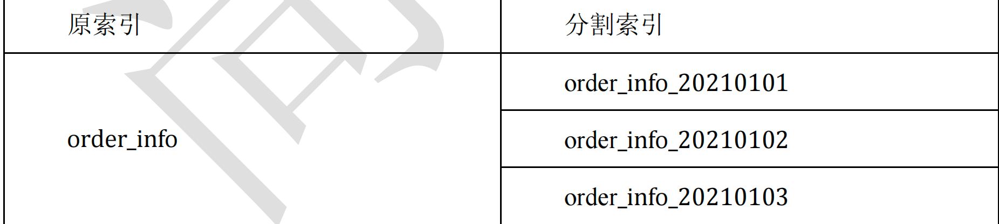</center>

 **好处**

1. **查询范围优化**。因为一般情况并不会查询全部时间周期的数据，那么通过切分索引，物理上减少了扫描数据的范围，也是对性能的优化。类似于大家学过的 Hive 中的分区表。 
2. **结构变化的灵活性**。因为 elasticsearch 不允许对数据结构进行修改。但是实际使用中索引的结构和配置难免变化，那么只要对下一个间隔的索引进行修改，原来的索引位置原状。这样就有了一定的灵活性。


>其实类似于clickhouse这些OLAP的将数据按照时间进行分区。
>
>而这样会引发两个问题：
>
>- 索引怎么根据日期新创建一个呢？
>- 索引名字变化，查询的名字是不是也要变化？


### 索引别名

索引别名就像一个快捷方式或**软连接**，**可以指向一个或多个索引**，也可以给任何一个需要索引名的 API 来使用。*别名* 带给我们极大的灵活性，允许我们做下面这些：

1. **给多个索引分组**。分割索引可以解决数据结构变更的场景， 但是分割的频繁，如果想要统计一个大周期的数据(例如季度、年)，数据是分散到不同的索引中的，统计比较麻烦。我们可以将分割的索引取相同的别名，这样，我们在统计时直接指定别名即可。
2. **给索引的一个子集创建视图**。将一个索引中的部分数据(基于某个条件)创建别名，查询此部分数据时，可以直接使用别名。
3. **在运行的集群中可以无缝的从一个索引切换到另一个索引**。如果涉及到索引的切换，我们可以在程序中指定别名，而不是索引。当需要切换索引时，我们可以直接从一个索引上减去别名，在另一个索引上加上别名（减与加为原子操作）实现无缝切换。

**建表时直接声明**：

```json
PUT movie_index_1
{ "aliases": {
    "movie_index_1_20210101": {}
}, 
 "mappings": {
     "properties": {
         "id":{
             "type": "long"
         },
         "name":{
             "type": "text"
             , "analyzer": "ik_smart"
         },
         "doubanScore":{
             "type": "double"
         },
         "actorList":{
             "properties": {
                 "id":{
                     "type":"long"
                 },
                 "name":{
                     "type":"keyword"
                 }
             }
         }
     }
 } }
```

**为已存在的索引增加别名**：

```json
POST _aliases
{
    "actions": [
        { "add": { "index": "movie_index", "alias": 
                  "movie_index_2021" }}
    ] 
}
POST _aliases
{
    "actions": [
        { "add": { "index": "movie_index_cn", "alias": 
                  "movie_index_2021" }}
    ] 
}
```

**通过加过滤条件缩小查询范围，建立一个子集视图**：

```json
POST _aliases
{
    "actions": [
        { "add": 
         { "index": "movie_index", 
          "alias": "movie_index_query_zhy",
          "filter": {
              "term": { 
                  "actorList.name.keyword": "zhang han yu"
              }
          } }}
    ] 
}
```

**查询别名，与使用普通索引没有区别**：

```json
GET movie_index_2021/_search
```

**删除某个索引的别名**：

```json
POST _aliases
{
    "actions": [
        { "remove": {
            "index": "movie_index", 
            "alias": "movie_index_2021" }}
    ] 
}
```

**为某个别名进行无缝切换**：

```json
POST /_aliases
{
    "actions": [
        { "remove": { 
            "index": "movie_index", 
            "alias": "movie_index_2021" }},

        { "add": { 
            "index": "movie_index_cn",
            "alias": "movie_index_2021" }}
    ] 
}
```

**查询别名列表**：

```json
GET _cat/aliases?v
```


### 索引模版

Index Template 索引模板，顾名思义，就是创建索引的模具，其中可以定义一系列规则来帮助我们构建符合特定业务需求的索引的 mappings 和 settings，通过使用 Index Template 可以让我们的索引具备可预知的一致性。

```json
PUT _template/template_movie2021
{
    "index_patterns": ["movie_test*"], 
    "settings": { 
        "number_of_shards": 1
    },
    "aliases" : { 
        "{index}-query": {},
        "movie_test-query":{}
    },
    "mappings": { 
        "properties": {
            "id": {
                "type": "keyword"
            },
            "movie_name": {
                "type": "text",
                "analyzer": "ik_smart"
            }
        }
    } 
}
```

其中 **"index_patterns": ["movie_test*"],** 的含义就是凡是往 movie_test 开头的索引写入数据时，如果索引不存在，那么 es 会根据此模板自动建立索引。

在 "aliases" 中用**{index}**表示，获得真正的创建的索引名。

**查看系统中已有的模板清单**

```json
GET _cat/templates?v
```

**查看某个模板详情**

```json
GET _template/template_movie2021
```


**测试模板:**

（1）**创建索引**

```json
POST movie_test_20210101/_doc
{
    "id":"111",
    "movie_name":"zhang111"
}
POST movie_test_20210102/_doc
{
    "id":"222",
    "movie_name":"zhang222"
}
```

（2）**查看索引** **mapping**

```json
GET movie_test_20210101/_mapping
```

```json
{
    "movie_test_20210101" : {
        "mappings" : {
            "properties" : {
                "id" : {
                    "type" : "keyword"
                },
                "movie_name" : {
                    "type" : "text",
                    "analyzer" : "ik_smart"
                }
            }
        }
    } 
}
```

```json
GET movie_test_20210102/_mapping
```

```json
{
    "movie_test_20210102" : {
        "mappings" : {
            "properties" : {
                "id" : {
                    "type" : "keyword"
                },
                "movie_name" : {
                    "type" : "text",
                    "analyzer" : "ik_smart"
                }
            }
        }
    } 
}
```


现在来回答之前的两个问题：

1. 因为创建了索引模版，因此只要满足模版pattern的数据插入，如果此时没有index，就会直接创建；
2. 读取某一天的index，可以用index名字，而读取所有的index，可以直接使用别名读取全部。


## 集群架构

### **集群节点**

一个ES集群可以有多个节点构成，一个节点就是一个ES服务实例，通过配置集群名称cluster.name加入集群。那么节点是如何通过配置相同的集群名称加入集群的呢？要搞明白这个问题，我们必须先搞清楚ES集群中节点的角色。

ES中节点有角色的区分的，通过配置文件conf/elasticsearch.yml中配置以下配置进行角色的设定：

```yml
node.master: true/false
node.data: true/false
```

集群中单个节点既可以是候选主节点也可以是数据节点，通过上面的配置可以进行两两组合形成四大分类：

（1）仅为候选主节点
（2）既是候选主节点也是数据节点
（3）仅为数据节点
（4）既不是候选主节点也不是数据节点

**候选主节点：**只有是候选主节点才可以参与选举投票，也只有候选主节点可以被选举为主节点。

**主节点：**负责索引的添加、删除，跟踪哪些节点是群集的一部分，对分片进行分配、收集集群中各节点的状态等，稳定的主节点对集群的健康是非常重要。

**数据节点：**负责对数据的增、删、改、查、聚合等操作，数据的查询和存储都是由数据节点负责，对机器的CPU，IO以及内存的要求比较高，一般选择高配置的机器作为数据节点。

此外还有一种节点角色叫做**协调节点**，其本身不是通过设置来分配的，用户的请求可以随机发往任何一个节点，并由该节点负责分发请求、收集结果等操作，而不需要主节点转发。这种节点可称之为协调节点，集群中的任何节点都可以充当协调节点的角色。每个节点之间都会保持联系。


### 发现机制

**ZenDiscovery**是ES的内置发现机制，提供单播和多播两种发现方式，主要职责是集群中节点的发现以及选举Master节点。

- **多播也叫组播**，指一个节点可以向多台机器发送请求。生产环境中ES不建议使用这种方式，对于一个大规模的集群，组播会产生大量不必要的通信。
- **单播**，当一个节点加入一个现有集群，或者组建一个新的集群时，请求发送到一台机器。当一个节点联系到单播列表中的成员时，它就会得到整个集群所有节点的状态，然后它会联系Master节点，并加入集群。

只有在同一台机器上运行的节点才会自动组成集群。ES 默认被配置为使用单播发现，单播列表不需要包含集群中的所有节点，它只是需要足够的节点，当一个新节点联系上其中一个并且通信就可以了。如果你使用 Master 候选节点作为单播列表，你只要列出三个就可以了。

这个配置在 elasticsearch.yml 文件中：

```text
discovery.zen.ping.unicast.hosts: ["host1", "host2:port"]
```

**集群信息收集阶段**采用了 **Gossip** 协议，上面配置的就相当于一个seed nodes，Gossip协议这里就不多做赘述了。

ES官方建议**unicast.hosts配置为所有的候选主节点**，ZenDiscovery 会每隔ping_interval（配置项）ping一次，每次超时时间是discovery.zen.ping_timeout（配置项），3次(ping_retries配置项)ping失败则认为节点宕机，宕机的情况下会触发failover，会进行分片重分配、复制等操作。

如果宕机的节点不是Master，则**Master会更新集群的元信息，Master节点将最新的集群元信息发布出去，给其他节点，其他节点回复Ack，Master节点收到discovery.zen.minimum_master_nodes的值-1个 候选主节点的回复，则发送Apply消息给其他节点，集群状态更新完毕。如果宕机的节点是Master，则其他的候选主节点开始Master节点的选举流程。**


#### 选主

Master的选主过程中要确保只有一个master，ES通过一个参数quorum的代表多数派阈值，保证选举出的master被至少quorum个的候选主节点认可，以此来保证只有一个master。

选主的发起由候选主节点发起，当前候选主节点发现自己不是master节点，并且通过ping其他节点发现无法联系到主节点，并且包括自己在内已经有超过minimum_master_nodes个节点无法联系到主节点，那么这个时候则发起选主。

选主流程图：

<center></center>

选主的时候按照集群节点的参数<stateVersion, id> 排序。stateVersion从大到小排序，以便选出集群元信息较新的节点作为Master，id从小到大排序，避免在stateVersion相同时发生分票无法选出 Master。

排序后第一个节点即为Master节点。当一个候选主节点发起一次选举时，它会按照上述排序策略选出一个它认为的Master。


#### 脑裂

提到分布式系统选主，不可避免的会提到脑裂这样一个现象，什么是脑裂呢？如果集群中选举出多个Master节点，使得数据更新时出现不一致，这种现象称之为脑裂。

简而言之集群中不同的节点对于 Master的选择出现了分歧，出现了多个Master竞争。

一般而言脑裂问题可能有以下几个**原因**造成：

- **网络问题：**集群间的网络延迟导致一些节点访问不到Master，认为Master 挂掉了，而master其实并没有宕机，而选举出了新的Master，并对Master上的分片和副本标红，分配新的主分片。
- **节点负载：**主节点的角色既为Master又为Data，访问量较大时可能会导致 ES 停止响应（假死状态）造成大面积延迟，此时其他节点得不到主节点的响应认为主节点挂掉了，会重新选取主节点。
- **内存回收：**主节点的角色既为Master又为Data，当Data节点上的ES进程占用的内存较大，引发JVM的大规模内存回收，造成ES进程失去响应。

如何避免脑裂：我们可以基于上述原因，做出优化措施：

- **适当调大响应超时时间，减少误判**。通过参数 discovery.zen.ping_timeout 设置节点ping超时时间，默认为 3s，可以适当调大。
- 角色分离，即是上面我们提到的候选主节点和数据节点进行角色分离，这样可以减轻主节点的负担，防止主节点的假死状态发生，减少对主节点宕机的误判。
- 选举触发，我们需要在候选节点的配置文件中设置参数 discovery.zen.munimum_master_nodes 的值。这个参数表示在选举主节点时需要参与选举的候选主节点的节点数，默认值是 1，官方建议取值(master_eligibel_nodes/2)+1，其中 master_eligibel_nodes 为候选主节点的个数。这样做既能防止脑裂现象的发生，也能最大限度地提升集群的高可用性，因为只要不少于 discovery.zen.munimum_master_nodes 个候选节点存活，选举工作就能正常进行。当小于这个值的时候，无法触发选举行为，集群无法使用，不会造成分片混乱的情况。


## 分布式读写原理

### 写流程（基于_id）

<center>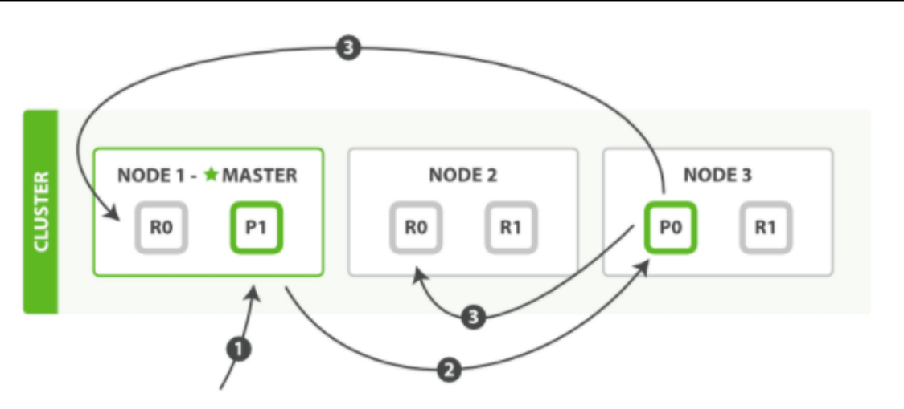</center>

1. 写操作必须在**主分片**上面完成之后才能被复制到相关的副本分片（**ES为了提高写入的能力这个过程是并发写的，同时为了解决并发写的过程中数据冲突的问题，ES通过乐观锁的方式控制，每个文档都有一个 _version号，当文档被修改时版本号递增。**）；

2. 客户端向 Node 1 发送写操作请求，此时 Node1 为协调节点（接收客户端请求的 节点）；

3. Node1 节点使用文档的_id 通过公式计算确定文档属于分片 0 。请求会被转发到Node 3，因为分片 0 的主分片目前被分配在 Node 3 上。分片计算公式： 

   ```bash
   shard = hash(routing) % number_of_primary_shards
   ```

   routing 是一个可变值，默认是文档的 _id ，也可以设置成一个自定义的值。 routing 通过 hash 函数生成一个数字，然后这个数字再除以 number_of_primary_shards （主分片的数量）后得到余数 。这个分布在 0 到 number_of_primary_shards-1 之间的余数，就是我们所寻求的文档所在分片的位置。

4. Node 3 在主分片上面执行请求。如果成功了，它将请求并行转发到 Node 1 和 Node 2 的副本分片上。一旦所有的副本分片都报告成功, Node 3 将向协调节点报告成功，协调节点向客户端报告成功；

>Q：那么如果 shard 的数量变化，是不是数据就要重新 rehash 呢？
>
>A：不会，因为一个 index 的 shards 数量是不能改变的。


### 读流程（基于_id）

<center>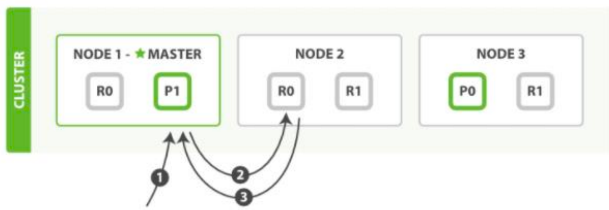</center>

1. 读操作可以从主分片或者从其它任意副本分片检索文档；
2. 客户端向 Node 1 发送读请求，Node1 为协调节点；
3. 节点使用文档的 _id 来确定文档属于分片 0 。分片 0 的主副分片存在于所有的三个节点上。协调节点在每次请求的时候都会通过**轮询**的方式将请求打到不同的节点上来达到负载均衡，假设本次它将请求转发到 Node 2 ；
4. Node 2 将文档返回给 Node 1 ，Node1 然后将文档返回给客户端。


### 搜索流程（_search）

<center>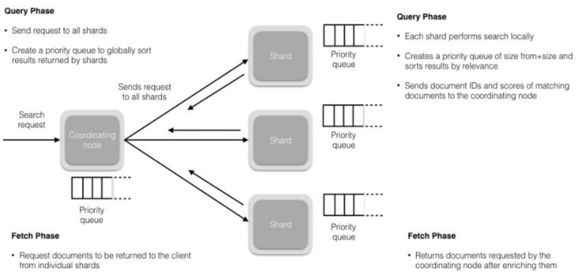</center>

1. 搜索被执行成一个两阶段过程，我们称之为 **Query Then Fetch** ；

2. 在初始查询阶段时，查询会广播到索引中每一个分片（主分片或者副本分片）。 每个分片在本地执行搜索并构建一个匹配文档的大小为 from + size 的优先队列；

   > PS：在搜索的时候是会查询 Filesystem Cache 的，但是有部分数据还在 Memory Buffer，所以搜索是近实时的。

3. 每个分片返回各自优先队列中所有文档的 ID 和排序值 给协调节点，它合并这些值到自己的优先队列中来产生一个全局排序后的结果列表；

4. 接下来就是取回阶段，协调节点辨别出哪些文档需要被取回并向相关的分片提交多个 GET 请求。每个分片加载并丰富文档，接着返回文档给协调节点。一旦所有的文档都被取回了，协调节点返回结果给客户端。


### 文档的修改和并发控制

ElasticSearch 中的全部文档数据都是不可变的，数据不能修改，只能通过版本号的方式不断增加。这样做的主要目的是解决更新过程中的并发冲突问题。

<center>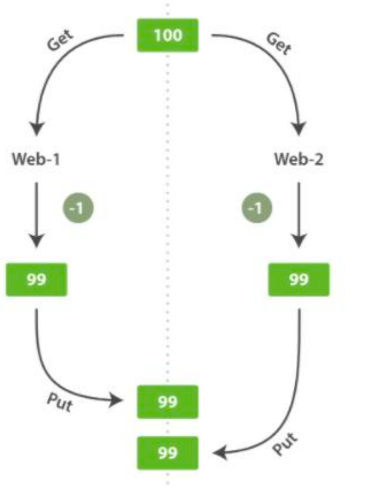</center>

1. **悲观并发控制**

   这种方法被关系型数据库广泛使用，它假定有变更冲突可能发生，因此阻塞访问资源以防止冲突。 一个典型的例子是读取一行数据之前先将其锁住，确保只有获取锁的线程才能够对这行数据进行修改。

2. **乐观并发控制**

   Elasticsearch 中使用的这种方法假定冲突是不可能发生的，并且不会阻塞正在尝试的操作。 然而，如果源数据在读写当中被修改，更新将会失败。应用程序接下来将决定该如何解决冲突。 例如，可以重试更新、使用新的数据、或者将相关情况报告给用户。

ElasticSearch是分布式的，当文档创建、更新、删除时，新版本的文档必须复制到集群中其他节点，同时，ElasticSearch也是异步和并发的。这就意味着这些复制请求被并行发送，并且到达目的地时也许顺序是乱的(老版本可能在新版本之后到达)。ElasticSaerch需要一种方法确保文档的旧版本不会覆盖新的版本：ES利用**_version** (版本号)的方式来确保应用中相互冲突的变更不会导致数据丢失。需要修改数据时，需要指定想要修改文档的version号，如果该版本不是当前版本号，请求将会失败。

ElasticSearch中有**内部版本号和外部版本号**之分：

- 使用内部版本号是要求指定的version字段和当前的version号相同；
- 但在使用外部版本号时要求当前version号小于指定的版本号。如果请求成功，外部版本号作为文档新的version号进行存储。

```bash
# 内部版本号命令：
PUT /website/blog/1?version=1 
# 外部版本号命令：
PUT /website/blog/2?version=5&version_type=external
```


### 删除和修改

- **删除**，由于不可修改，所以对于删除操作，**不会把文档从旧的段中移除，而是通过新增一个 .del 文件，里面将某个doc标记为delete状态**，文件中会列出这些被删除文档的段信息，这个被标记删除的文档仍然可以被查询匹配到， 但它会在最终结果被返回前从结果集中移除。
- **更新**，不能修改旧的段来进行文档的更新，其实**更新相当于是删除和新增这两个动作组成**。会将旧的文档在 .del 文件中标记删除，然后文档的新版本中被索引到一个新的段。可能两个版本的文档都会被一个查询匹配到，但被删除的那个旧版本文档在结果集返回前就会被移除。


###  shard与段

由于索引一般是以天为单位进行建立，如果业务线很多，每个索引又不注意控制分片，日积月累下来一个集群几万到几十万个分片也是不难见到的。

#### shard太多带来的危害

**每个分片都有 Lucene 索引，这些索引都会消耗 cpu 和内存**。**同样的数据，分片越多，额外消耗的 cpu 和内存就越多**，会出现“1+1”>2 的情况。

**shard 的目的是为了负载均衡让每个节点的硬件充分发挥，但是如果分片多，在单个节点上的多个 shard 同时接受请求，并对本节点的资源形成了竞争，实际上反而造成了内耗。**


#### 如何规划shard数量

1. 根据每日数据量规划shard数量。以按天划分索引情况为例，单日数据评估低于 10G 的情况可以只使用一个分片，高于10G 的情况，单一分片也不能太大不能超过 30G。所以一个 200G 的单日索引大致划分 7-10个分片。 

2. 根据堆内存规划shard数量。另外从堆内存角度，一个 Elasticsearch 服务官方推荐的最大堆内存是 32G。一个 10G 分片，大致会占用 30-80M 堆内存，那么对于这个 32G 堆内存的节点，最好不要超过 1000 个分片。

   >There is another reason to not allocate enormous heaps to Elasticsearch. As it turns out, the HotSpot JVM uses a trick to compress object pointers when heaps are less than around 32 GB.Once you cross that magical ~32 GB boundary, the pointers switch back to ordinary object pointers. The size of each pointer grows, more CPU-memory bandwidth is used, and you effectively lose memory. In fact, it takes until around 40–50 GB of allocated heap before you have the same effective memory of a heap just under 32 GB using compressed oops.

   简意就是 JVM 在 32G 以下时会使用一种压缩技术，这种压缩技术对于内存使用性价比高，如果超过 32GB，大概可能要 50 个 G 的内存才能达到压缩方案的 32G 。

   另外还有一个原因就是，除了 JVM 的堆内存，lucene 引擎会使用大量的堆外内存，用于比如：可读缓存等等。所以建议预留堆内存的一倍空间给操作系统。


#### shard优化

1. 及时归档冷数据。
2. 降低单个分片占用的资源消耗，具体方法就是：合并分片中多个 segment（段）。


### 存储原理

#### 存储过程

我们知道ES是基于Lucene实现的，内部是通过Lucene完成的索引的创建写入和搜索查询，Lucene 工作原理如下图所示：

<center>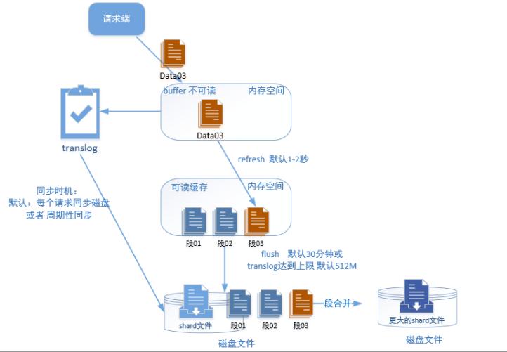</center>

1. 当新添加一片文档时，Lucene进行分词等预处理，然后将文档写入内存中，此时的数据是不可读的；并将本次操作写入事务日志（transLog），transLog类似于mysql的redo log，用于宕机后内存数据的恢复，保存未持久化数据的操作日志；
2. 默认情况下，Lucene每隔1s(**refresh_interval**配置项)将内存中的数据刷新到文件系统缓存中，称为一个segment（段）。一旦刷入文件系统缓存，segment才可以被用于检索，在这之前是无法被检索的；
3. 因此refresh_interval决定了ES数据的实时性，因此说ES是一个准实时的系统。segment 在磁盘中是不可修改的，因此避免了磁盘的随机写，所有的随机写都在内存中进行。随着时间的推移，segment越来越多，默认情况下，**Lucene每隔30min或translog 空间大于512M**，将缓存中的segment持久化落盘，称为一个commit point(commit point 保存了此次的所有segment file)，此时删掉对应的transLog；
4. 落盘到磁盘文件后多个段以文件形式保存，后台周期性或手动进行段合并，把段中的数据合并到 shard 文件中。

**translog的作用**：在执行commit之前，所有的数据都是停留在buffer中，一旦这台机器死了，内存的数据就会丢失，所以需要将数据对应的操作写入一个专门的日志问价之中，一旦机器出现宕机，再次重启的时候，es会主动的读取translog之中的日志文件的数据，恢复到内存buffer之中。

>当我们在进行写操作的测试的时候，可以通过手动刷新来保障数据能够被及时检索到，但是不要在生产环境下每次索引一个文档都去手动刷新，刷新操作会有一定的性能开销。一般业务场景中并不都需要每秒刷新。
>
>可以通过在 Settings 中调大 refresh_interval = "30s" 的值，来降低每个索引的刷新频率，设值时需要注意后面带上时间单位，否则默认是毫秒。当 refresh_interval=-1 时表示关闭索引的自动刷新。


#### 新增、更新、删除

**索引文件分段存储并且不可修改，那么新增、更新和删除如何处理呢？**

- **新增**，新增很好处理，由于数据是新的，所以只需要对当前文档新增一个段就可以了。
- **删除**，由于不可修改，所以对于删除操作，**不会把文档从旧的段中移除，而是通过新增一个 .del 文件，里面将某个doc标记为delete状态**，文件中会列出这些被删除文档的段信息，这个被标记删除的文档仍然可以被查询匹配到， 但它会在最终结果被返回前从结果集中移除。
- **更新**，不能修改旧的段来进行文档的更新，其实**更新相当于是删除和新增这两个动作组成**。会将旧的文档在 .del 文件中标记删除，然后文档的新版本中被索引到一个新的段。可能两个版本的文档都会被一个查询匹配到，但被删除的那个旧版本文档在结果集返回前就会被移除。

segment被设定为不可修改具有一定的优势也有一定的缺点。

优点：

- 不需要锁。如果你从来不更新索引，你就不需要担心多进程同时修改数据的问题。
- 一旦索引被读入内核的文件系统缓存，便会留在哪里，由于其不变性。只要文件系统缓存中还有足够的空间，那么大部分读请求会直接请求内存，而不会命中磁盘。这提供了很大的性能提升.
- 其它缓存(像 Filter 缓存)，在索引的生命周期内始终有效。它们不需要在每次数据改变时被重建，因为数据不会变化。
- 写入单个大的倒排索引允许数据被压缩，减少磁盘 I/O 和需要被缓存到内存的索引的使用量。

缺点：

- 当对旧数据进行删除时，旧数据不会马上被删除，而是在 .del 文件中被标记为删除。而**旧数据只能等到段更新时才能被移除，这样会造成大量的空间浪费**。
- 若有一条数据频繁的更新，每次更新都是新增新的，标记旧的，则会有大量的空间浪费。
- **每次新增数据时都需要新增一个段来存储数据**。当段的数量太多时，对服务器的资源例如文件句柄的消耗会非常大。
- **在查询的结果中包含所有的结果集，需要排除被标记删除的旧数据，这增加了查询的负担**。


#### 段合并

由于每当刷新一次就会新建一个segment（段），这样会导致短时间内的段数量暴增，而segment数目太多会带来较大的麻烦。大量的segment会影响数据的读性能。每一个segment都会消耗文件句柄、内存和CPU 运行周期。更重要的是**，每个搜索请求都必须轮流检查每个segment然后合并查询结果，所以segment越多，搜索也就越慢。**

因此Lucene会按照一定的策略将segment合并，合并的时候会将那些旧的已删除文档从文件系统中清除。被删除的文档不会被拷贝到新的大segment中。

合并的过程中不会中断索引和搜索，倒排索引的数据结构使得文件的合并是比较容易的。

**段合并在进行索引和搜索时会自动进行，合并进程选择一小部分大小相似的段，并且在后台将它们合并到更大的段中，这些段既可以是未提交的也可以是已提交的。**

**合并结束后老的段会被删除，新的段被刷新到磁盘，同时写入一个包含新段且排除旧的和较小的段的新提交点，新的段被打开，可以用来搜索**。段合并的计算量庞大，而且还要吃掉大量磁盘 I/O，并且段合并会拖累写入速率，如果任其发展会影响搜索性能。

ES在默认情况下会对合并流程进行资源限制，所以搜索性能可以得到保证。

<center>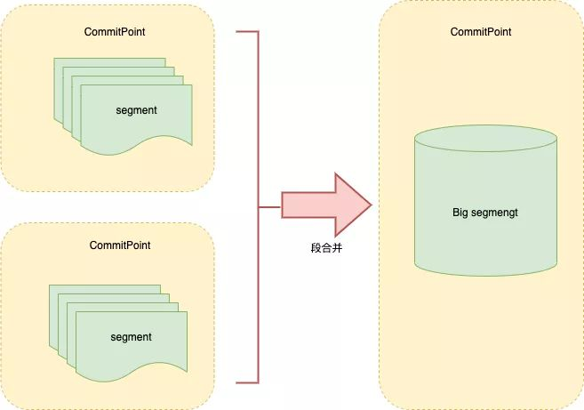</center>

如果尽可能的把小的 segment 合并成为大 segment，这样既节省内存又提高查询性能。于是 Es 后台实际上会周期性的执行合并 segment 的任务。但是由于 ES 担心这种合并操作会占用资源，影响搜索性能（事实上也确实很有影响尤其是在有写操作的时候）。所以有很多内置的限制和门槛设置的非常保守，导致很久不会触发合并，或者合并效果不理想。

**可以进行手动优化**：

生产环境中如果是以天为单位切割索引的话，我们其实是可以明确的知道只要某个索引过了当天，就几乎不会再有什么写操作了，这个时候其实是一个主动进行合并的好时机。

可以利用如下语句主动触发合并操作：

```bash
POST movie_index/_forcemerge?max_num_segments=1
```

查看索引的段情况：

```bash
GET _cat/indices/?s=segmentsCount:desc&v&h=index,segmentsCount,segmen
tsMemory,memoryTotal,storeSize,p,r
```


## Java使用

### 客户端

目前市面上有两类客户端。

- 一类是 TransportClient 为代表的 ES 原生客户端，不能执行原生 dsl 语句，必须使用它的 Java api 方法；
- 另外一种是以 Rest Api 为主的 missing client，最典型的就是 jest。 这种客户端可以直接使用 dsl 语句拼成的字符串，直接传给服务端，然后返回 json 字符串再解析。

两种方式各有优劣，但是最近 elasticsearch 官网，宣布计划在 7.0 以后的版本中废除TransportClient，以 RestClient 为主。目前 RestClient 类型的 es 客户端有很多种，比如 Jest、 **High level Rest Client**、 ElasticsearchRestTemplate 等。


### 准备环境

（1）**创建工程**

（2）**在** **pom.xml** **中加入** **es** **所需依赖**

```xml
<dependency>
    <groupId>org.elasticsearch</groupId>
    <artifactId>elasticsearch</artifactId>
    <version>7.8.0</version>
</dependency>
<!-- elasticsearch 的客户端 -->
<dependency>
    <groupId>org.elasticsearch.client</groupId>
    <artifactId>elasticsearch-rest-high-level-client</artifactId>
    <version>7.8.0</version>
</dependency>
<dependency>
    <groupId>org.apache.httpcomponents</groupId>
    <artifactId>httpclient</artifactId>
    <version>4.5.10</version>
</dependency>
<dependency>
    <groupId>com.alibaba</groupId>
    <artifactId>fastjson</artifactId>
    <version>1.2.62</version>
</dependency>
```


### 写入数据

（1）**在** **ES** **中创建** **index**

```bash
PUT movie_test_20210103
```

（2）**单条数据写入**

```scala
object EsTest {
    //声明 es 客户端
    var esClient : RestHighLevelClient = build()
    
    def main(args: Array[String]): Unit = {
        val movie = Movie("100","梅艳芳")
        save(movie,"movie_test20210103")
        destory()
    }
    /**
     * 销毁
     */
    def destory(): Unit ={
        esClient.close()
        esClient = null
    }
    /**
     * 创建 es 客户端对象
     */
    def build():RestHighLevelClient = {
        val builder: RestClientBuilder = RestClient.builder(new 
                                                            HttpHost("hadoop102",9200))
        val esClient = new RestHighLevelClient(builder)
        esClient
    } 
}
```

（3）**单条数据幂等写入**

```scala
def main(args: Array[String]): Unit = {
    val source: (String, Movie) = ("101",Movie("101","功夫"))
    saveIdempotent(source,"movie_test20210103")
    destory()
}
/**
 * 单条数据幂等写入
 * 通过指定 id 实现幂等
 */
def saveIdempotent(source:(String , AnyRef),indexName : String ): 
Unit = {
    val indexRequest = new IndexRequest()
    indexRequest.index(indexName)
    val movieJsonStr: String = JSON.toJSONString(source._2, new 
                                                 SerializeConfig(true))
    indexRequest.source(movieJsonStr,XContentType.JSON)
    indexRequest.id(source._1)
    esClient.index(indexRequest,RequestOptions.DEFAULT)
}
```

（4）**批量数据写入**

```scala
def main(args: Array[String]): Unit = {
    val movies = List(Movie("102","速度与激情"), Movie("103","八佰
") )
    bulkSave(movies,"movie_test20210103")
    destory()
}
/**
 * 批量数据写入
 */
def bulkSave(sourceList: List[AnyRef] ,indexName: String ): Unit 
={
    // BulkRequest 实际上就是由多个单条 IndexRequest 的组合
    val bulkRequest = new BulkRequest()
    for (source <- sourceList) {
        val indexRequest = new IndexRequest()
        indexRequest.index(indexName)
        val movieJsonStr: String = JSON.toJSONString(source, new 
                                                     SerializeConfig(true))
        indexRequest.source(movieJsonStr,XContentType.JSON)
        bulkRequest.add(indexRequest)
    }
    esClient.bulk(bulkRequest,RequestOptions.DEFAULT)
}
```

（5）**批量数据幂等写入**

```scala
def main(args: Array[String]): Unit = {
    val movies = List(("104" , Movie("104","红海行动")), ("105", 
                                                      Movie("105","湄公河行动")) )
    bulkSaveIdempotent(movies,"movie_test20210103")
    destory()
}
/**
 * 批量数据幂等写入
 * 通过指定 id 实现幂等
 */
def bulkSaveIdempotent(sourceList: List[(String , 
                                         AnyRef)] ,indexName: String ): Unit ={
    // BulkRequest 实际上就是由多个单条 IndexRequest 的组合
    val bulkRequest = new BulkRequest()
    for ((docId,sourceObj) <- sourceList) {
        val indexRequest = new IndexRequest()
        indexRequest.index(indexName)
        val movieJsonStr: String = JSON.toJSONString(sourceObj, new 
                                                     SerializeConfig(true))
        indexRequest.source(movieJsonStr,XContentType.JSON)
        indexRequest.id(docId)
        bulkRequest.add(indexRequest)
    }
    esClient.bulk(bulkRequest,RequestOptions.DEFAULT)
}
```


### 修改数据

（1）**根据** **docid** **更新字段**

```scala
def main(args: Array[String]): Unit = {
    val source= ("101", "movie_name", "功夫功夫功夫")
    update(source,"movie_test20210103")
}
/**
 * 根据 docid 更新字段
 */
def update( source :( String, String , String ) , 
           indexName:String ): Unit ={
    val updateRequest = new UpdateRequest()
    updateRequest.index(indexName)
    val sourceJson: String = JSON.toJSONString(source._2,new 
                                               SerializeConfig(true ))
    updateRequest.id(source._1)
    updateRequest.doc(XContentType.JSON,source._2, source._3)
    esClient.update(updateRequest,RequestOptions.DEFAULT)
}
```

（2）**根据查询条件修改**

```scala
def main(args: Array[String]): Unit = {
    updateByQuery("movie_name", " 八 佰 " , " 八 佰 good" , 
                  "movie_test20210103")
    destory()
}
/**
 * 根据条件修改
 * 将 指定字段 中包含有 srcValue 的统一修改为 newValue
 */
def updateByQuery( fieldName : String , srcValue: String , 
                  newValue : String , indexName:String ): Unit ={
    val updateByQueryRequest = new UpdateByQueryRequest()
    updateByQueryRequest.indices(indexName)
    val queryBuilder = QueryBuilders.matchQuery(fieldName,srcValue)
    val map = new util.HashMap[String,AnyRef]()
    map.put("newName",newValue)
    val script =
    new Script(ScriptType.INLINE , Script.DEFAULT_SCRIPT_LANG, 
               "ctx._source['movie_name']=params.newName" , map )
    updateByQueryRequest.setQuery(queryBuilder)
    updateByQueryRequest.setScript(script)
    esClient.updateByQuery(updateByQueryRequest , 
                           RequestOptions.DEFAULT)
}
```


### 删除数据

```scala
def main(args: Array[String]): Unit = {
    delete("101","movie_test20210103")
    destory()
}
/**
 * 删除
 */
def delete(docid : String , indexName : String ): Unit ={
    val deleteRequest = new DeleteRequest()
    deleteRequest.index(indexName)
    deleteRequest.id(docid)
    esClient.delete(deleteRequest,RequestOptions.DEFAULT)
}
```


### 查询数据

（1）**条件查询**

```scala
/**
 * search :
 *
 * 查询 doubanScore>=5.0 关键词搜索 red sea
 * 关键词高亮显示
 * 显示第一页，每页 20 条
 * 按 doubanScore 从大到小排序
 */
def search() : Unit = {
    val searchRequest = new SearchRequest()
    searchRequest.indices("movie_index")
    val searchSourceBuilder = new SearchSourceBuilder()
    //过滤匹配
    val boolQueryBuilder = new BoolQueryBuilder()
    val rangeQueryBuilder = new RangeQueryBuilder("doubanScore").gte("5.0")
    boolQueryBuilder.filter(rangeQueryBuilder)
    val matchQueryBuilder = new MatchQueryBuilder("name","red sea")
    boolQueryBuilder.must(matchQueryBuilder)
    searchSourceBuilder.query(boolQueryBuilder)
    //高亮
    val highlightBuilder: HighlightBuilder = new HighlightBuilder().field("name")
    searchSourceBuilder.highlighter(highlightBuilder)
    //分页
    searchSourceBuilder.from(0)
    searchSourceBuilder.size(20)
    //排序
    searchSourceBuilder.sort("doubanScore",SortOrder.DESC)
    searchRequest.source(searchSourceBuilder)
    val searchResponse: SearchResponse = esClient.search(searchRequest, RequestOptions.DEFAULT)
    //处理结果
    //总数:
    val total: Long = searchResponse.getHits.getTotalHits.value
    println(s"共查询到 $total 条数据")
    //明细
    val hits: Array[SearchHit] = searchResponse.getHits.getHits
    for (searchHit <- hits) {
        val sourceJson : String = searchHit.getSourceAsString
        //高亮
        val fields: util.Map[String, HighlightField] = 
        searchHit.getHighlightFields
        val field: HighlightField = fields.get("name")
        val fragments: Array[Text] = field.getFragments
        val highlightText: Text = fragments(0)
        println(sourceJson)
        println(highlightText)
    }
}
```

（2）**聚合查询**

```scala
/**
 * 查询每位演员参演的电影的平均分，倒叙排序
 */
def searchAgg(): Unit ={
    val searchRequest = new SearchRequest()
    searchRequest.indices("movie_index")
    val searchSourceBuilder = new SearchSourceBuilder()
    //聚合
    //分组
    val termsAggregationBuilder: TermsAggregationBuilder = AggregationBuilders.terms("groupByActor").field("actorList.name.keyword").size(100).
    order(BucketOrder.aggregation("avg_score", false))
    //avg
    val avgAggregationBuilder: AvgAggregationBuilder = AggregationBuilders.avg("avg_score").field("doubanScore")
    termsAggregationBuilder.subAggregation(avgAggregationBuilder)
    searchSourceBuilder.aggregation(termsAggregationBuilder)
    searchRequest.source(searchSourceBuilder)
    val searchResponse: SearchResponse = esClient.search(searchRequest,RequestOptions.DEFAULT)
    //处理结果
    val groupByActorTerms: ParsedStringTerms = searchResponse.getAggregations.get[ParsedStringTerms]("groupByAct
or")
    val buckets: util.List[_ <: Terms.Bucket] = groupByActorTerms.getBuckets
    import scala.collection.JavaConverters._
    for (bucket <- buckets.asScala) {
        val actorName: AnyRef = bucket.getKey
        val movieCount: Long = bucket.getDocCount
        val aggregations: Aggregations = bucket.getAggregations
        val parsedAvg: ParsedAvg = 
        aggregations.get[ParsedAvg]("avg_score")
        val avgScore: Double = parsedAvg.getValue
        println(s"$actorName 共参演了 $movieCount 部电影， 平均评分为$avgScore")
    }
}
```

